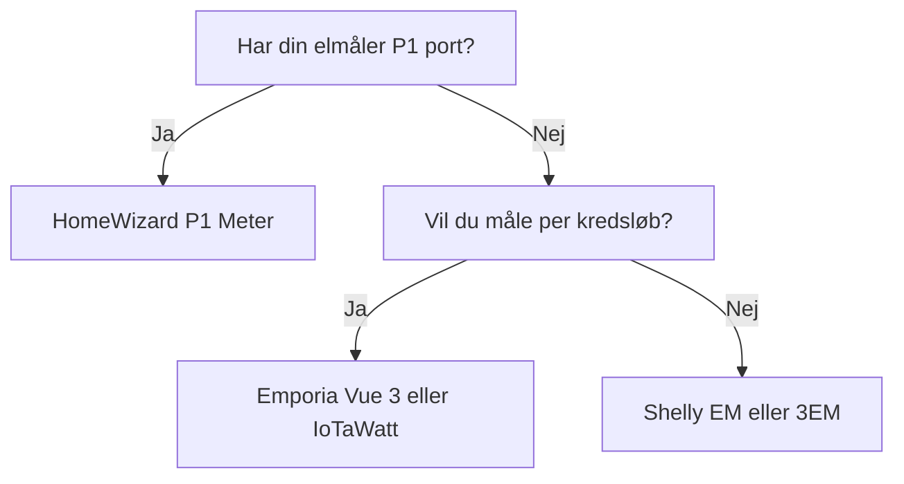

import { Card, CardGrid, Aside, Badge, Tabs, TabItem } from '@astrojs/starlight/components';
import FAQ from '../../../../components/FAQ.astro';
import HowTo from '../../../../components/HowTo.astro';
import AffiliateLink from '../../../../components/AffiliateLink.astro';

<HowTo
  name="Opsæt energiovervågning i dit hjem"
  description="Guide til energimålere og Home Assistant Energy Dashboard"
  totalTime="PT45M"
  steps={[
    "Vælg energimåler til dit behov",
    "Installer CT-klemmer eller P1-måler",
    "Integrer med Home Assistant",
    "Konfigurer Energy Dashboard",
    "Analyser og optimer dit forbrug"
  ]}
/>

<Badge text="Energi" variant="success" /> <Badge text="Besparelse" variant="tip" /> <Badge text="Lokal" variant="note" />

Energiovervågning er **grundlaget for smart strømstyring**. Ved at måle dit forbrug kan du identificere strømslugere, optimere forbruget, og spare penge - især med dynamiske elpriser.

<Aside type="tip" title="Top Anbefalinger 2025">
- **Danmark (P1)**: HomeWizard P1 Meter (~350 kr)
- **Hele huset (WiFi)**: Shelly Pro 3EM (~1.000 kr)
- **Per kredsløb**: Emporia Vue 3 (~1.500 kr)
- **Power user**: IoTaWatt (~2.000 kr)
- **Budget**: Shelly EM Gen3 (~400 kr)
</Aside>

---

## 📊 Typer af Energimåling

### Måleniveauer

| Type | Hvad måles | Bedst til | Eksempel |
|------|------------|-----------|----------|
| **P1 Port** | Hele huset via elmåler | DK/NL/BE | HomeWizard |
| **Hovedmåler** | Indgang fra net | Totalt overblik | Shelly 3EM |
| **Per kredsløb** | Individuelle sikringer | Find strømslugere | Emporia Vue |
| **Per enhed** | Enkelt apparat | Præcis måling | Smart plug |

### Hvad skal du vælge?



---

## 🇩🇰 P1 Port - Danmark

I Danmark har de fleste nye elmålere en **P1 port** der giver real-time data:

### HomeWizard P1 Meter

**Pris:** ~350 kr / $50

<Tabs>
  <TabItem label="Oversigt">
    ### Hvorfor HomeWizard?
    
    HomeWizard er den **nemmeste løsning** for danske hjem:
    
    - ✅ Plug-and-play (5 min installation)
    - ✅ **Works with Home Assistant** certificeret
    - ✅ Real-time data (1 sek opdatering)
    - ✅ Ingen el-installation
    - ✅ Lokal API (ingen cloud)
    - ✅ Import OG eksport måling
    - ✅ Gas og vand support (med ekstra enheder)
    
    **Ulemper:**
    - ❌ Kræver P1 port på elmåler
    - ❌ Kun totalt forbrug (ikke per kredsløb)
  </TabItem>
  <TabItem label="Installation">
    ### Nem Installation
    
    1. **Find din elmåler** (typisk i teknikskab)
    2. **Tilslut P1 kabel** til RJ12 porten
    3. **Download HomeWizard app**
    4. **Tilføj til WiFi**
    5. **Færdig!**
    
    ⚠️ **Tjek om din måler har P1 port:**
    - Kamstrup: Ja (RJ12 port)
    - Landis+Gyr: Ja (nogle modeller)
    - Kontakt dit elselskab hvis i tvivl
  </TabItem>
  <TabItem label="Home Assistant">
    ### HA Integration
    
    HomeWizard opdages **automatisk**:
    
    ```yaml
    # Ingen konfiguration nødvendig!
    # Indstillinger → Enheder → Tilføj Integration → HomeWizard
    
    # Entiteter du får:
    # - sensor.p1_meter_active_power (W)
    # - sensor.p1_meter_total_energy_import (kWh)
    # - sensor.p1_meter_total_energy_export (kWh)
    # - sensor.p1_meter_active_voltage_l1 (V)
    
    # Energy Dashboard
    # Indstillinger → Dashboards → Energy
    # Grid consumption: sensor.p1_meter_total_energy_import
    # Return to grid: sensor.p1_meter_total_energy_export
    ```
  </TabItem>
</Tabs>

**Køb:** [HomeWizard.com](https://homewizard.com), [Proshop.dk](https://proshop.dk)

---

## ⚡ Shelly Energimålere

### Shelly Lineup

| Model | Faser | Kanaler | Pris ca. | Bedst til |
|-------|-------|---------|----------|-----------|
| **Shelly EM Gen3** | 1-fase | 2 | 400 kr | Budget |
| **Shelly Pro EM-50** | 1-fase | 2 | 500 kr | DIN-montering |
| **Shelly Pro 3EM** | 3-fase | 3 | 1.000 kr | Hele huset |
| **Shelly Pro 3EM-400** | 3-fase | 3 (400A) | 1.200 kr | Store installationer |

---

## 🏠 Shelly Pro 3EM

<Tabs>
  <TabItem label="Oversigt">
    ### Hvorfor Shelly Pro 3EM?
    
    **Pris:** ~1.000 kr / $140
    
    Shelly Pro 3EM er **bedst til 3-fase huse**:
    
    - ✅ WiFi + Ethernet (stabilt)
    - ✅ 3 faser op til 120A hver
    - ✅ Bi-direktionel (import/eksport)
    - ✅ DIN-rail montering
    - ✅ ±1% nøjagtighed
    - ✅ Lokal API + MQTT
    - ✅ Native HA integration
    
    **Ulemper:**
    - ❌ Kræver el-installation
    - ❌ Kun hovedmåling (ikke per kredsløb)
  </TabItem>
  <TabItem label="Installation">
    ### El-installation
    
    ⚠️ **Kræver autoriseret elektriker!**
    
    **Komponenter:**
    - Shelly Pro 3EM
    - 3x CT klemmer (medfølger)
    
    **Installation:**
    1. Montér Shelly på DIN-skinne i tavle
    2. Tilslut 230V forsyning (L+N)
    3. Klips CT klemmer på hver fase
    4. Tilslut CT kabler til Shelly
    5. Konfigurer via Shelly app
  </TabItem>
  <TabItem label="Home Assistant">
    ### HA Integration
    
    ```yaml
    # Shelly opdages automatisk
    # Indstillinger → Enheder → Tilføj Integration → Shelly
    
    # Entiteter per fase:
    # - sensor.shelly_pro_3em_phase_a_power
    # - sensor.shelly_pro_3em_phase_a_energy
    # - sensor.shelly_pro_3em_phase_a_voltage
    # - sensor.shelly_pro_3em_total_active_power
    
    # Template for totalt forbrug
    template:
      - sensor:
          - name: "Total Power"
            unit_of_measurement: "W"
            state: >
              {{ states('sensor.shelly_pro_3em_phase_a_power')|float +
                 states('sensor.shelly_pro_3em_phase_b_power')|float +
                 states('sensor.shelly_pro_3em_phase_c_power')|float }}
    ```
  </TabItem>
</Tabs>

**Køb:** [Shelly.cloud](https://shelly.cloud), [Amazon.de](https://amazon.de)

---

## 📈 Emporia Vue 3 - Per Kredsløb

<Tabs>
  <TabItem label="Oversigt">
    ### Hvorfor Emporia Vue 3?
    
    **Pris:** ~1.500 kr / $200 (med 16 sensorer)
    
    Emporia Vue 3 er **bedst til kredsløbsmåling**:
    
    - ✅ Op til 16 individuelle kredsløb
    - ✅ Identificer strømslugere
    - ✅ WiFi + Ethernet
    - ✅ Solar/net-metering support
    - ✅ Kan flashe til ESPHome (lokal!)
    
    **Ulemper:**
    - ❌ Cloud-afhængig som standard
    - ❌ Kræver DIY for lokal kontrol
    - ❌ Hovedsageligt USA markedet
  </TabItem>
  <TabItem label="ESPHome Flash">
    ### Lokal med ESPHome
    
    Flash Emporia Vue til **100% lokal kontrol**:
    
    ```yaml
    # emporia-vue3.yaml
    esphome:
      name: emporia-vue3
    
    external_components:
      - source: github://digiblur/esphome-vue3@dev
        components:
          - emporia_vue
    
    esp32:
      board: esp32dev
      framework:
        type: esp-idf
    
    wifi:
      ssid: !secret wifi_ssid
      password: !secret wifi_password
    
    api:
    
    sensor:
      - platform: emporia_vue
        phases:
          - id: phase_a
            input: "A"
            calibration: 0.022
            power:
              name: "Phase A Power"
            # ... flere sensorer
    ```
    
    **Guide:** [digiblur.com](https://digiblur.com/2024/03/14/emporia-vue-gen3-esp32-esphome-home-assistant/)
  </TabItem>
</Tabs>

**Køb:** [Amazon.com](https://amazon.com), [Emporia Energy](https://emporiaenergy.com)

---

## 🔧 IoTaWatt - Power User

**Pris:** ~2.000 kr / $280

IoTaWatt er **community favoritten** for avancerede brugere:

| Fordele | Ulemper |
|---------|---------|
| ✅ 14 CT inputs | ❌ Dyr |
| ✅ 100% lokal (ingen cloud) | ❌ Svær at få i Europa |
| ✅ Open source | ❌ Mere kompleks setup |
| ✅ Meget nøjagtig | ❌ Kræver el-viden |
| ✅ Web interface | |
| ✅ Influx/Emoncms eksport | |

### Home Assistant Integration

```yaml
# IoTaWatt integreres via REST eller MQTT
# HACS: IoTaWatt integration

# Indstillinger → Enheder → Tilføj Integration → IoTaWatt
# Indtast IoTaWatt IP adresse

# Entiteter:
# - sensor.iotawatt_mains
# - sensor.iotawatt_varmepumpe
# - sensor.iotawatt_elbil_lader
# etc.
```

**Køb:** [IoTaWatt.com](https://iotawatt.com)

---

## 🔌 Smart Plugs med Energimåling

For **enkelt-enhed måling** brug smart plugs:

| Model | Protokol | Max Load | Pris ca. |
|-------|----------|----------|----------|
| **Shelly Plug S** | WiFi | 2500W | 200 kr |
| **Shelly Plus Plug S** | WiFi | 2500W | 250 kr |
| **Nous A1T** | WiFi (Tasmota) | 3680W | 100 kr |
| **IKEA TRETAKT** | Zigbee | 2300W | 100 kr |
| **Aqara Smart Plug** | Zigbee | 2300W | 150 kr |

### Kombination: Helhed + Detaljer

```yaml
# Bedste strategi: Hovedmåler + smart plugs

# 1. Shelly 3EM måler totalt forbrug
# 2. Smart plugs på store forbrugere:
#    - Vaskemaskine
#    - Tørretumbler
#    - Opvaskemaskine
#    - Gaming PC
#    - Køleskab

# Template: "Øvrigt forbrug"
template:
  - sensor:
      - name: "Other Power Usage"
        unit_of_measurement: "W"
        state: >
          
          
          
          
          {{ (total - washer - dryer - fridge)|round(1) }}
```

---

## 📱 Home Assistant Energy Dashboard

### Konfiguration

Home Assistants **Energy Dashboard** giver fantastisk overblik:

1. **Indstillinger** → **Dashboards** → **Energy**
2. **Electricity grid:**
   - Grid consumption: Din import sensor
   - Return to grid: Din eksport sensor (hvis solceller)
3. **Solar panels:** (valgfrit)
   - Solar production sensor
4. **Individual devices:**
   - Tilføj smart plugs med energimåling

### Elpriser Integration

```yaml
# Nordpool integration for dynamiske priser
# HACS → Integrationer → Nordpool

# configuration.yaml
nordpool:

# Energy Dashboard:
# - Use an entity tracking current price: sensor.nordpool_kwh_dk1_dkk_3_10_025
```

---

## 💰 Automationer for Besparelse

### Kør apparater når strømmen er billig

```yaml
automation:
  - alias: "Start vaskemaskine ved lav elpris"
    trigger:
      - platform: numeric_state
        entity_id: sensor.nordpool_kwh_dk1_dkk_3_10_025
        below: 1.50  # Under 1.50 kr/kWh
    condition:
      - condition: state
        entity_id: input_boolean.vaskemaskine_venter
        state: "on"
      - condition: time
        after: "06:00:00"
        before: "22:00:00"
    action:
      - service: switch.turn_on
        entity_id: switch.vaskemaskine_smart_plug
      - service: notify.mobile_app
        data:
          title: "Vaskemaskine startet"
          message: "Elpris er nu {{ states('sensor.nordpool_kwh_dk1_dkk_3_10_025') }} kr/kWh"
```

### Alert ved høj strøm

```yaml
automation:
  - alias: "Alert ved højt forbrug"
    trigger:
      - platform: numeric_state
        entity_id: sensor.shelly_3em_total_power
        above: 5000  # Over 5 kW
        for:
          minutes: 5
    action:
      - service: notify.mobile_app
        data:
          title: "⚡ Højt strømforbrug!"
          message: "Dit forbrug er {{ states('sensor.shelly_3em_total_power') }}W lige nu"
```

### Find standby-forbrug

```yaml
automation:
  - alias: "Rapport: Natforbrug"
    trigger:
      - platform: time
        at: "06:00:00"
    action:
      - service: notify.mobile_app
        data:
          title: "Natforbrug rapport"
          message: >
            I nat brugte du {{ 
              (states('sensor.shelly_3em_energy_today')|float * 
               (6/24))|round(2) 
            }} kWh mens du sov.
```

---

## 🛒 Købs Strategi

### Starter - P1 (~350 kr)
- 1x HomeWizard P1 Meter (350 kr)
- **Total:** ~350 kr

### Basis - Hovedmåling (~1.200 kr)
- 1x Shelly Pro 3EM (1.000 kr)
- Installation af elektriker (~500 kr)
- **Total:** ~1.500 kr

### Komplet - Per kredsløb (~3.000 kr)
- 1x HomeWizard P1 (350 kr)
- 1x Emporia Vue 3 16-pak (1.500 kr)
- 4x Shelly smart plugs (800 kr)
- Installation (~500 kr)
- **Total:** ~3.150 kr

### Premium - Fuld indsigt (~5.000 kr)
- 1x IoTaWatt + 14 CT (2.500 kr)
- 1x HomeWizard P1 (350 kr)
- 6x Shelly smart plugs (1.200 kr)
- Installation (~1.000 kr)
- **Total:** ~5.050 kr

---

## 🛒 Hvor Køber Jeg?

### 🇩🇰 Køb hos Proshop (Hurtig dansk levering)

| Produkt | Type | Køb |
|---------|------|-----|
| Shelly Pro 3EM CT63 | 3-faset energimåler | <AffiliateLink store="proshop" url="https://www.proshop.dk/Smart-Home/Shelly-Pro-3EM-CT63/3302037" text="Køb" /> |
| Eve Energy Matter | Smart plug m/måler | <AffiliateLink store="proshop" url="https://www.proshop.dk/Smart-Home/Eve-Energy-Smart-Plug-Power-Meter-Matter/3154143" text="Køb" /> |
| Eve Energy 3-Pack | Smart plugs | <AffiliateLink store="proshop" url="https://www.proshop.dk/Smart-Home/Eve-Energy-Matter-3-Pack/8500805" text="Køb" /> |
| Shelly Plus 1PM | Relæ m/energimåling | <AffiliateLink store="proshop" url="https://www.proshop.dk/Smart-Home/Shelly-Plus-1PM/3027897" text="Køb" /> |

<Aside type="note" title="Affiliate">
Links til Proshop er affiliate links. [Læs mere](/da/juridisk/affiliate-disclosure/)
</Aside>

### Andre forhandlere

**P1 Målere**
- **[HomeWizard.com](https://homewizard.com)** - Direkte

**CT-baserede Målere**
- **[Shelly.cloud](https://shelly.cloud)** - Shelly produkter
- **[IoTaWatt.com](https://iotawatt.com)** - IoTaWatt

**Smart Plugs**
- **[IKEA.dk](https://ikea.dk)** - TRETAKT Zigbee

---

## ❓ Ofte Stillede Spørgsmål

<FAQ questions={[
  {
    question: "Har min elmåler P1 port?",
    answer: "De fleste nye danske elmålere (Kamstrup, Landis+Gyr) har P1 port. Tjek efter en RJ12 stik på måleren, eller kontakt dit elselskab. Hvis din måler er ældre end 2015, har den sandsynligvis ikke P1."
  },
  {
    question: "Hvad er forskellen på CT-klemmer og P1?",
    answer: "P1 læser data direkte fra din elmåler - nemt men kun totalt forbrug. CT-klemmer måler strømmen fysisk og kan placeres på individuelle kredsløb, men kræver el-installation."
  },
  {
    question: "Skal jeg have elektriker til installation?",
    answer: "For P1 og smart plugs: Nej. For CT-baserede målere i eltavlen: Ja, det kræves juridisk og er farligt uden erfaring. Regn med 500-1000 kr for installation."
  },
  {
    question: "Kan jeg se forbrug per rum?",
    answer: "Ikke direkte med hovedmåler. Brug enten Emporia Vue med CT på hver sikring, eller smart plugs på større apparater. Kombination af begge giver bedst indsigt."
  },
  {
    question: "Hvor meget kan jeg spare?",
    answer: "Typisk 10-20% ved at identificere strømslugere og flytte forbrug til billige timer. Med dynamiske elpriser kan besparelsen være endnu højere."
  },
  {
    question: "Virker energimåling med solceller?",
    answer: "Ja! Bi-direktionelle målere (Shelly 3EM, HomeWizard P1) kan måle både import og eksport. Home Assistant Energy Dashboard viser produktion, forbrug og netto."
  }
]} />

---

## 📚 Næste Skridt

<CardGrid>
  <Card title="Dynamiske Elpriser" icon="rocket">
    Udnyt billige timer.
    
    [Se guide →](/da/home-assistant/elpris-integration/)
  </Card>
  <Card title="Home Assistant" icon="setting">
    Integrer alt i ét system.
    
    [Kom i gang →](/da/home-assistant/)
  </Card>
</CardGrid>

---

*Sidst opdateret: December 2025*
