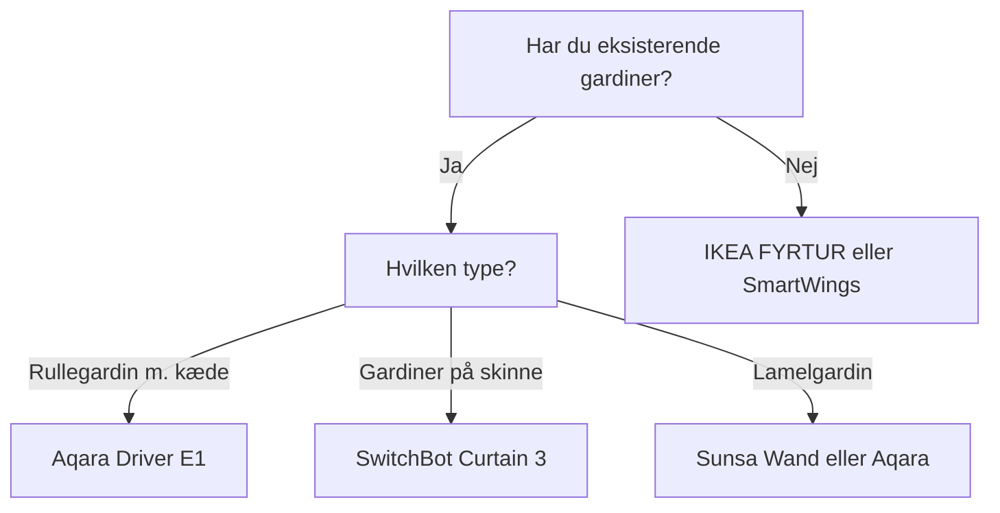

import { Card, CardGrid, Aside, Badge, Tabs, TabItem } from '@astrojs/starlight/components';
import FAQ from '../../../../components/FAQ.astro';
import HowTo from '../../../../components/HowTo.astro';
import AffiliateLink from '../../../../components/AffiliateLink.astro';

<HowTo
  name="Opsæt smarte gardiner"
  description="Guide til motoriserede gardiner og rullegardiner med Home Assistant"
  totalTime="PT30M"
  steps={[
    "Vælg gardin-type til dine vinduer",
    "Installer motor eller komplet gardin",
    "Par med Zigbee hub eller WiFi",
    "Integrer med Home Assistant",
    "Opret sol- og tidsautomationer"
  ]}
/>

<Badge text="Gardiner" variant="success" /> <Badge text="Automatik" variant="note" /> <Badge text="Energi" variant="tip" />

Smarte gardiner giver **automatisk lys- og temperaturstyring** - luk gardiner ved solnedgang, åbn ved solopgang, eller blokér sol når det bliver for varmt. Kombineret med sensorer får du et intelligent hjem der tilpasser sig selv.

<Aside type="tip" title="Top Anbefalinger 2025">
- **Budget komplet**: IKEA FYRTUR (~1.000 kr)
- **Retrofit rullegardin**: Aqara Roller Shade Driver E1 (~400 kr)
- **Retrofit gardiner**: SwitchBot Curtain 3 (~700 kr)
- **Premium**: Lutron Serena (~3.000+ kr)
- **DIY motor**: Zemismart Zigbee motor (~500 kr)
</Aside>

---

## 🎯 Typer af Smart Gardiner

### Overblik

| Type | Beskrivelse | Installation | Pris |
|------|-------------|--------------|------|
| **Komplet gardin** | Motor indbygget | Udskift eksisterende | 💰💰 |
| **Retrofit motor** | Motor til eksisterende | Tilføj til gardin | 💰 |
| **Kæde-driver** | Drejer kugglekæde | Simpel tilføjelse | 💰 |
| **Gardinskinne-motor** | Motor til skinne | Montering på skinne | 💰💰 |

### Hvad skal du vælge?



---

## 🏆 IKEA FYRTUR - Bedste Budget

<Tabs>
  <TabItem label="Oversigt">
    ### Hvorfor IKEA FYRTUR?
    
    **Pris:** ~1.000-1.500 kr / $130-200 (afhængig af størrelse)
    
    FYRTUR er **bedste valg for de fleste**:
    
    - ✅ Komplet løsning (gardin + motor)
    - ✅ 100% blackout (mørklægning)
    - ✅ Zigbee (fungerer med ZHA, Z2M)
    - ✅ Medfølgende fjernbetjening
    - ✅ Genopladeligt batteri (4-6 mdr)
    - ✅ HomeKit/Alexa/Google via DIRIGERA
    - ✅ Flere størrelser (60-140 cm bredde)
    
    **Ulemper:**
    - ❌ Begrænsede størrelser
    - ❌ Kun grå/hvid farver
    - ❌ Zigbee pairing kan være tricky
    
    **Andre IKEA modeller:**
    | Model | Type | Pris ca. |
    |-------|------|----------|
    | **FYRTUR** | Blackout | 1.000-1.500 kr |
    | **KADRILJ** | Semi-transparent | 1.000-1.400 kr |
    | **PRAKTLYSING** | Cellular blackout | 1.200-1.600 kr |
    | **TREDANSEN** | Cellular blackout | 1.200-1.600 kr |
  </TabItem>
  <TabItem label="Installation">
    ### Nem Installation
    
    1. **Montér beslag** på væg eller loft
    2. **Klik gardin på plads**
    3. **Tilslut batteri**
    4. **Par fjernbetjening** (holder allerede par)
    5. **Sæt grænser** (op/ned positioner)
    
    ### Opladning
    
    - USB-C kabel medfølger
    - Batteri holder 4-6 måneder
    - Oplad uden at afmontere
    
    **Pro tip:** Montér gardin så USB-port er tilgængelig!
  </TabItem>
  <TabItem label="Home Assistant">
    ### HA Integration via ZHA/Z2M
    
    FYRTUR fungerer bedst med **Zigbee2MQTT**:
    
    ```yaml
    # Zigbee2MQTT konfiguration
    # Pair: Hold parringsknap 10 sek (på motor)
    
    # Entiteter:
    # - cover.ikea_fyrtur_stue
    # - sensor.ikea_fyrtur_stue_battery
    
    # Eksempel: Åbn ved solopgang
    automation:
      - alias: "Åbn gardiner ved solopgang"
        trigger:
          - platform: sun
            event: sunrise
            offset: "00:15:00"
        condition:
          - condition: workday
            country: DK
        action:
          - service: cover.open_cover
            entity_id: cover.ikea_fyrtur_sovevaerelse
    
      - alias: "Luk gardiner ved solnedgang"
        trigger:
          - platform: sun
            event: sunset
            offset: "-00:15:00"
        action:
          - service: cover.close_cover
            entity_id: 
              - cover.ikea_fyrtur_stue
              - cover.ikea_fyrtur_sovevaerelse
    ```
  </TabItem>
</Tabs>

**Køb:** [IKEA.dk](https://ikea.dk)

---

## 🔧 Aqara Roller Shade Driver E1

<Tabs>
  <TabItem label="Oversigt">
    ### Hvorfor Aqara Driver E1?
    
    **Pris:** ~400 kr / $55
    
    Aqara E1 **motoriserer eksisterende rullegardiner**:
    
    - ✅ Retrofit (behold dit gardin)
    - ✅ Zigbee 3.0
    - ✅ USB-C opladning
    - ✅ 2 måneders batteri
    - ✅ HomeKit via Aqara hub
    - ✅ Fungerer med perle/kugle-kæder
    - ✅ Nem 10-min installation
    
    **Ulemper:**
    - ❌ Kræver Aqara hub til HomeKit
    - ❌ Kun til kæde-betjente gardiner
    - ❌ Synlig motor-enhed
    
    **Kompatible kæder:**
    - Plastik perler: 3-6 mm
    - Metal kugler: 3-4.5 mm
  </TabItem>
  <TabItem label="Installation">
    ### 10-Minutters Installation
    
    1. **Montér holder** ved siden af gardin
    2. **Før kæde** gennem motor
    3. **Klips motor fast**
    4. **Par med Aqara app**
    5. **Kalibrer op/ned positioner**
    
    ⚠️ **Tjek kæde-type først!** 
    - Mål kugle/perle diameter
    - Skal være 3-6 mm
  </TabItem>
  <TabItem label="Home Assistant">
    ### HA Integration
    
    Via **Aqara hub** eller direkte **ZHA/Z2M**:
    
    ```yaml
    # Direkte Zigbee pairing
    # Entiteter:
    # - cover.aqara_roller_shade_koekken
    # - sensor.aqara_roller_shade_koekken_battery
    
    # Eksempel: Luk ved høj temperatur
    automation:
      - alias: "Luk gardiner ved varme"
        trigger:
          - platform: numeric_state
            entity_id: sensor.stue_temperatur
            above: 24
        condition:
          - condition: sun
            after: sunrise
            before: sunset
        action:
          - service: cover.close_cover
            entity_id: cover.aqara_roller_shade_stue
    ```
  </TabItem>
</Tabs>

**Køb:** [Amazon.de](https://amazon.de), [AliExpress](https://aliexpress.com)

---

## 🎭 SwitchBot Curtain 3 - Til Gardinskinne

<Tabs>
  <TabItem label="Oversigt">
    ### Hvorfor SwitchBot Curtain 3?
    
    **Pris:** ~700 kr / $100
    
    SwitchBot Curtain 3 **motoriserer gardinskinne**:
    
    - ✅ Fungerer med U-skinne og I-skinne
    - ✅ Solar panel tilbehør (aldrig oplade)
    - ✅ Touch & Go (træk for at aktivere)
    - ✅ QuietDrift mode (ultra stille)
    - ✅ Matter support via Hub
    - ✅ Op til 16 kg gardin
    
    **Ulemper:**
    - ❌ Kræver Hub for fuld smart integration
    - ❌ Synlig på skinnen
    - ❌ Bluetooth uden hub
    
    **Tilbehør:**
    | Produkt | Pris ca. |
    |---------|----------|
    | **SwitchBot Hub Mini** | 300 kr |
    | **Solar Panel** | 150 kr |
    | **Remote** | 150 kr |
  </TabItem>
  <TabItem label="Installation">
    ### Installation på Skinne
    
    1. **Vælg korrekt adapter** (U/I-skinne)
    2. **Montér SwitchBot** på skinnen
    3. **Tilslut til gardin-krog**
    4. **Par via SwitchBot app**
    5. **Kalibrer åben/lukket position**
    
    **Skinne-typer:**
    - **U-skinne**: Standard dansk skinne
    - **I-skinne**: Tynd/flat skinne
    - **Rod**: Gardin-stang (kræver Rod adapter)
  </TabItem>
  <TabItem label="Home Assistant">
    ### HA Integration
    
    Kræver **SwitchBot Hub** for WiFi:
    
    ```yaml
    # Via SwitchBot integration
    # Indstillinger → Enheder → SwitchBot
    
    # Entiteter:
    # - cover.switchbot_curtain_stue
    # - sensor.switchbot_curtain_stue_battery
    # - sensor.switchbot_curtain_stue_light
    
    # Eksempel: Åbn ved bevægelse om morgenen
    automation:
      - alias: "Åbn gardiner ved morgen-aktivitet"
        trigger:
          - platform: state
            entity_id: binary_sensor.sovevaerelse_motion
            to: "on"
        condition:
          - condition: time
            after: "06:00:00"
            before: "09:00:00"
          - condition: state
            entity_id: cover.switchbot_curtain_sovevaerelse
            state: "closed"
        action:
          - service: cover.open_cover
            entity_id: cover.switchbot_curtain_sovevaerelse
    ```
  </TabItem>
</Tabs>

**Køb:** [SwitchBot.com](https://switchbot.com), [Amazon.de](https://amazon.de)

---

## 🏗️ Zemismart - DIY Motor

**Pris:** ~400-800 kr / $55-110

Zemismart tilbyder **standalone tubulære motorer** til rullegardiner:

| Model | Protokol | Pris ca. | Bedst til |
|-------|----------|----------|-----------|
| **AM15** | Zigbee | 500 kr | Smart home |
| **AM25** | WiFi/Tuya | 400 kr | Tuya økosystem |
| **Solar** | Zigbee + solar | 700 kr | Svær adgang |
| **Battery** | RF + batteri | 600 kr | Enkelt setup |

### Installation

⚠️ **Kræver DIY erfaring:**

1. Fjern eksisterende gardin
2. Montér tubulær motor i rør
3. Geninstallér stof
4. Par med Zigbee/WiFi

**Pro tip:** Køb motor der matcher dit rørs diameter (25mm, 35mm, 38mm).

**Køb:** [AliExpress](https://aliexpress.com), [Amazon.de](https://amazon.de)

---

## 💎 Premium: Lutron Serena

**Pris:** ~3.000-8.000 kr / $400-1000+

Lutron Serena er **premium-løsningen**:

| Fordele | Ulemper |
|---------|---------|
| ✅ 200+ stof/farve valg | ❌ Meget dyr |
| ✅ Perfekt integration | ❌ Kræver Lutron hub |
| ✅ Professionel kvalitet | ❌ Specialbestilling |
| ✅ Super stille motor | |
| ✅ Batteri eller kabel | |
| ✅ HomeKit/Alexa/Google | |

### Home Assistant

```yaml
# Lutron Caséta integration
# Indstillinger → Enheder → Lutron Caséta

# Entiteter:
# - cover.serena_stue
# - cover.serena_sovevaerelse
```

**Køb:** [Lutron.com](https://lutron.com)

---

## 🏠 Smarte Automationer

### Basis: Sol op/ned

```yaml
automation:
  - alias: "Gardiner ved solopgang"
    trigger:
      - platform: sun
        event: sunrise
        offset: "00:15:00"
    condition:
      - condition: workday
        country: DK
    action:
      - service: cover.open_cover
        entity_id: 
          - cover.sovevarelse
          - cover.stue

  - alias: "Gardiner ved solnedgang"
    trigger:
      - platform: sun
        event: sunset
        offset: "-00:15:00"
    action:
      - service: cover.close_cover
        entity_id: all
```

### Avanceret: Temperatur-baseret

```yaml
automation:
  - alias: "Blokér sol ved varme"
    trigger:
      - platform: numeric_state
        entity_id: sensor.stue_temperatur
        above: 25
    condition:
      - condition: sun
        after: sunrise
        before: sunset
      - condition: numeric_state
        entity_id: sensor.udendors_temperatur
        above: 20
    action:
      - service: cover.close_cover
        entity_id: cover.stue_sydvendt
      - service: notify.mobile_app
        data:
          title: "Gardiner lukket"
          message: "Blokerer sol pga. temperatur over 25°C"

  - alias: "Åbn gardiner når det køler"
    trigger:
      - platform: numeric_state
        entity_id: sensor.stue_temperatur
        below: 23
    condition:
      - condition: state
        entity_id: cover.stue_sydvendt
        state: "closed"
    action:
      - service: cover.open_cover
        entity_id: cover.stue_sydvendt
```

### Bio-tilstand (med medier)

```yaml
automation:
  - alias: "Luk gardiner ved film"
    trigger:
      - platform: state
        entity_id: media_player.stue_tv
        to: "playing"
    condition:
      - condition: template
        value_template: >
          {{ state_attr('media_player.stue_tv', 'media_content_type') == 'movie' }}
      - condition: sun
        before: sunset
    action:
      - service: cover.close_cover
        entity_id: cover.stue
      - service: light.turn_on
        entity_id: light.stue
        data:
          brightness_pct: 10
```

### Ferie-tilstand

```yaml
automation:
  - alias: "Simuler tilstedeværelse"
    trigger:
      - platform: time_pattern
        hours: "/2"  # Hver 2. time
    condition:
      - condition: state
        entity_id: input_boolean.ferie_tilstand
        state: "on"
      - condition: sun
        after: sunset
        before: sunrise
    action:
      - delay:
          minutes: "{{ range(5, 30)|random }}"
      - service: cover.set_cover_position
        entity_id: cover.stue
        data:
          position: "{{ range(20, 80)|random }}"
```

---

## 🛒 Købs Strategi

### Starter - Ét vindue (~1.000 kr)
- 1x IKEA FYRTUR (1.000 kr)
- **Total:** ~1.000 kr

### Basis - 3 vinduer (~2.500 kr)
- 3x Aqara Roller Shade Driver E1 (1.200 kr)
- 1x Aqara Hub M2 (500 kr)
- Eksisterende rullegardiner
- **Total:** ~1.700 kr

### Komplet stue (~4.000 kr)
- 2x IKEA FYRTUR (2.500 kr)
- 2x SwitchBot Curtain 3 (1.400 kr)
- 1x SwitchBot Hub Mini (300 kr)
- **Total:** ~4.200 kr

### Hele huset (~10.000 kr)
- 6x IKEA FYRTUR (7.500 kr)
- 2x Aqara Driver E1 (800 kr)
- 1x Aqara Hub (500 kr)
- 2x SwitchBot Curtain (1.400 kr)
- **Total:** ~10.200 kr

---

## 🛒 Hvor Køber Jeg?

### 🇩🇰 Køb hos Proshop (Hurtig dansk levering)

| Produkt | Type | Køb |
|---------|------|-----|
| Shelly 2PM Gen3 | Gardinstyring | <AffiliateLink store="proshop" url="https://www.proshop.dk/Smart-Home/Shelly-2PM-Gen3/3302030" text="Køb" /> |
| MotionBlinds Retrofit Motor | Rullegardin | <AffiliateLink store="proshop" url="https://www.proshop.dk/Smart-Home/MotionBlinds-Retrofit-Motor-for-Roller-Blinds/3131576" text="Køb" /> |

[Se hele MotionBlinds udvalg →](https://www.partner-ads.com/dk/klikbanner.php?partnerid=55881&bannerid=67785&htmlurl=https%3A%2F%2Fwww.proshop.dk%2FMotionblinds)

<Aside type="note" title="Affiliate">
Links til Proshop er affiliate links. [Læs mere](/da/juridisk/affiliate-disclosure/)
</Aside>

### Andre forhandlere

**Komplet Løsninger**
- **[IKEA.dk](https://ikea.dk)** - FYRTUR, KADRILJ
- **[Lutron.com](https://lutron.com)** - Premium Serena

**Retrofit Motorer**
- **[Amazon.de](https://amazon.de)** - Aqara, SwitchBot
- **[SwitchBot.com](https://switchbot.com)** - Curtain 3

---

## ❓ Ofte Stillede Spørgsmål

<FAQ questions={[
  {
    question: "Kan jeg automatisere mine eksisterende gardiner?",
    answer: "Ja! Aqara Roller Shade Driver E1 fungerer med kæde-rullegardiner, SwitchBot Curtain 3 fungerer med gardinskinne-gardiner. Du behøver ikke købe nye gardiner."
  },
  {
    question: "Hvor lang tid holder batteriet?",
    answer: "IKEA FYRTUR: 4-6 måneder. Aqara E1: 2 måneder. SwitchBot: 8 måneder (eller uendeligt med solar panel). Afhænger af brug."
  },
  {
    question: "Fungerer IKEA FYRTUR med Home Assistant?",
    answer: "Ja, via Zigbee2MQTT eller ZHA. Pairing kan være lidt tricky, men fungerer godt når det er sat op. Du behøver ikke IKEA's hub."
  },
  {
    question: "Hvad er forskellen på FYRTUR og KADRILJ?",
    answer: "FYRTUR er 100% blackout (mørklægning) - perfekt til soveværelser. KADRILJ er semi-transparent og filtrerer lys uden at blokere helt."
  },
  {
    question: "Kan jeg styre gardiner baseret på solen?",
    answer: "Ja! Home Assistant kan trigge på solopgang/solnedgang, solens position, og endda beregne om solen rammer et specifikt vindue baseret på azimut."
  },
  {
    question: "Er smarte gardiner det værd?",
    answer: "Absolut for soveværelser (automatisk mørklægning) og sydvendte vinduer (blokér varme om sommeren). Besparelsen på køling kan være betydelig."
  }
]} />

---

## 📚 Næste Skridt

<CardGrid>
  <Card title="Smart Belysning" icon="sun">
    Kombiner gardiner med lys.
    
    [Se guide →](/da/produkter/smart-belysning/)
  </Card>
  <Card title="Smart Termostater" icon="sun">
    Optimer temperatur med gardiner.
    
    [Se guide →](/da/produkter/smart-termostater/)
  </Card>
</CardGrid>

---

*Sidst opdateret: December 2025*
