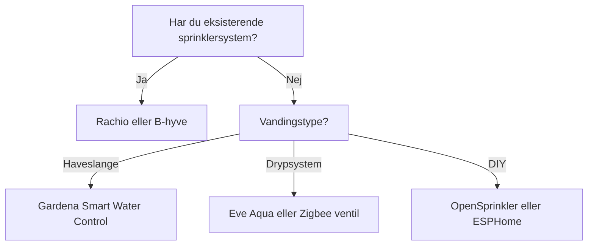

import { Card, CardGrid, Aside, Badge, Tabs, TabItem } from '@astrojs/starlight/components';
import FAQ from '../../../../components/FAQ.astro';
import HowTo from '../../../../components/HowTo.astro';
import AffiliateLink from '../../../../components/AffiliateLink.astro';

<HowTo
  name="Opsæt smart havevanding"
  description="Guide til automatisk vanding med vejrdata og jordfugtighed"
  totalTime="PT45M"
  steps={[
    "Vælg vandingscontroller til dit behov",
    "Installer controller og ventiler",
    "Forbind til WiFi og app",
    "Integrer med Home Assistant",
    "Tilføj sensorer og automationer"
  ]}
/>

<Badge text="Haven" variant="success" /> <Badge text="Vanding" variant="note" /> <Badge text="Automatik" variant="tip" />

Smart havevanding sparer **op til 50% vand** ved at bruge vejrdata, jordfugtighed og intelligente skemaer. Stop med at vande når det regner, og sørg for at dine planter får præcis den mængde vand de behøver.

<Aside type="tip" title="Top Anbefalinger 2025">
- **Premium**: Rachio 3 (~1.500 kr / $180)
- **Bedste værdi**: Orbit B-hyve (~700 kr / $95)
- **DIY/Lokal**: OpenSprinkler (~1.400 kr / $190)
- **Hanetimer**: Gardena Smart Water Control (~800 kr / $110)
- **Plantesensor**: Xiaomi Mi Flora (~150 kr / $20)
</Aside>

---

## 🎯 Typer af Smart Vanding

### Overblik

| Type | Beskrivelse | Installation | Pris |
|------|-------------|--------------|------|
| **Sprinkler controller** | Erstatter eksisterende timer | Elektrikerarbejde | 💰💰 |
| **Hanetimer** | Monteres på vandhanee | Simpel | 💰 |
| **Drypsystem** | Til højbede/potter | DIY | 💰 |
| **DIY ESPHome** | Fuld kontrol | Avanceret | 💰 |

### Hvad skal du vælge?



---

## 🏆 Rachio 3 - Premium Valg

<Tabs>
  <TabItem label="Oversigt">
    ### Hvorfor Rachio 3?
    
    **Pris:** ~1.500 kr / $180 (8 zoner)
    
    Rachio 3 er **markedsleder** i smart vanding:
    
    - ✅ Weather Intelligence Plus (hyperlokal vejr)
    - ✅ EPA WaterSense certificeret
    - ✅ Sparer op til 50% vand
    - ✅ 8 eller 16 zoner
    - ✅ HomeKit, Alexa, Google, SmartThings
    - ✅ Native Home Assistant integration
    - ✅ Fremragende app og support
    
    **Ulemper:**
    - ❌ Kræver udendørs kabinet ($30 ekstra)
    - ❌ Cloud-afhængig
    - ❌ Dyrere end konkurrenter
    
    **Modeller:**
    | Model | Zoner | Pris ca. |
    |-------|-------|----------|
    | **Rachio 3** | 8 | 1.500 kr / $180 |
    | **Rachio 3** | 16 | 2.000 kr / $230 |
    | **Rachio 3e** | 8 | 1.200 kr / $130 |
  </TabItem>
  <TabItem label="Installation">
    ### Installation
    
    1. **Sluk for strøm** til eksisterende controller
    2. **Fotografér ledninger** før afmontering
    3. **Montér Rachio** (indendørs eller med kabinet)
    4. **Tilslut ledninger** (zone 1-8/16 + common)
    5. **Download app** og konfigurer WiFi
    6. **Opsæt zoner** med plantetype, sol, jordbund
    
    ⚠️ **Kræver 24V AC transformer** (ofte medfølger)
    
    **Pro tip:** Tag billeder af alle ledninger!
  </TabItem>
  <TabItem label="Home Assistant">
    ### HA Integration
    
    Native integration - nem opsætning:
    
    ```yaml
    # Indstillinger → Enheder → Rachio
    # Brug din Rachio API nøgle
    
    # Entiteter:
    # - switch.rachio_zone_1
    # - switch.rachio_zone_2
    # - binary_sensor.rachio_rain_delay
    # - sensor.rachio_daily_water_usage
    
    # Eksempel: Stop vanding ved regn
    automation:
      - alias: "Skip vanding ved regn"
        trigger:
          - platform: state
            entity_id: weather.home
            attribute: forecast
        condition:
          - condition: template
            value_template: >
              {{ state_attr('weather.home', 'forecast')[0].precipitation > 5 }}
        action:
          - service: rachio.set_rain_delay
            data:
              entity_id: switch.rachio_zone_1
              duration: 86400  # 24 timer
    
      - alias: "Notifikation ved vanding"
        trigger:
          - platform: state
            entity_id: switch.rachio_zone_1
            to: "on"
        action:
          - service: notify.mobile_app
            data:
              title: "Havevanding"
              message: "Zone 1 vander nu i 15 minutter"
    ```
  </TabItem>
</Tabs>

**Køb:** [Amazon.de](https://amazon.de), [Rachio.com](https://rachio.com)

---

## 💰 Orbit B-hyve - Bedste Værdi

<Tabs>
  <TabItem label="Oversigt">
    ### Hvorfor Orbit B-hyve?
    
    **Pris:** ~700 kr / $95 (8 zoner)
    
    B-hyve giver **næsten samme funktioner til halv pris**:
    
    - ✅ WeatherSense teknologi
    - ✅ EPA WaterSense certificeret
    - ✅ Vandtæt kabinet (XR model)
    - ✅ 6, 8 eller 12 zoner
    - ✅ Alexa og Google Assistant
    - ✅ Manuel betjening på enheden
    - ✅ Nem app med guide
    
    **Ulemper:**
    - ❌ Ingen HomeKit
    - ❌ Mindre præcis vejrdata end Rachio
    - ❌ Begrænset HA integration
    
    **Modeller:**
    | Model | Zoner | Placering | Pris ca. |
    |-------|-------|-----------|----------|
    | **B-hyve** | 6 | Indendørs | 600 kr / $80 |
    | **B-hyve** | 12 | Indendørs | 750 kr / $100 |
    | **B-hyve XR** | 8 | Udendørs | 900 kr / $120 |
  </TabItem>
  <TabItem label="Installation">
    ### Nem Installation
    
    1. **Afbryd strøm** til gammel controller
    2. **Montér B-hyve** (vandtæt XR kan være ude)
    3. **Tilslut zoneledninger**
    4. **Download B-hyve app**
    5. **Gennemgå opsætningsguide**
    
    App'en guider dig gennem:
    - Zonetype (græs, blomster, grøntsager)
    - Jordbund (sand, ler, muld)
    - Hældning og soleksponering
  </TabItem>
  <TabItem label="Home Assistant">
    ### HA Integration
    
    Via HACS custom integration:
    
    ```yaml
    # HACS → Integrations → B-hyve
    # Kræver Orbit konto login
    
    # Entiteter:
    # - switch.bhyve_zone_1
    # - sensor.bhyve_next_watering
    
    # Eksempel: Vanding baseret på jordfugtighed
    automation:
      - alias: "Vand ved lav jordfugtighed"
        trigger:
          - platform: numeric_state
            entity_id: sensor.have_jordfugtighed
            below: 30
        condition:
          - condition: time
            after: "05:00:00"
            before: "07:00:00"
          - condition: state
            entity_id: binary_sensor.regn_idag
            state: "off"
        action:
          - service: switch.turn_on
            entity_id: switch.bhyve_zone_1
          - delay: "00:15:00"
          - service: switch.turn_off
            entity_id: switch.bhyve_zone_1
    ```
  </TabItem>
</Tabs>

**Køb:** [Amazon.de](https://amazon.de), [Bauhaus.dk](https://bauhaus.dk)

---

## 🔧 OpenSprinkler - DIY & Lokal

<Tabs>
  <TabItem label="Oversigt">
    ### Hvorfor OpenSprinkler?
    
    **Pris:** ~1.400 kr / $190 (8 zoner)
    
    OpenSprinkler er **open source og 100% lokal**:
    
    - ✅ Ingen cloud - fuld lokal kontrol
    - ✅ Open source software
    - ✅ MQTT support
    - ✅ Raspberry Pi version (OSPi)
    - ✅ Avancerede vandingsalgoritmer
    - ✅ Tilføj sensorer via GPIO
    
    **Ulemper:**
    - ❌ Mere kompleks opsætning
    - ❌ Ingen stemmeassistent direkte
    - ❌ Kræver teknisk forståelse
    
    **Modeller:**
    | Model | Type | Pris ca. |
    |-------|------|----------|
    | **OpenSprinkler 3.2** | Standalone | 1.400 kr |
    | **OSPi** | Raspberry Pi HAT | 800 kr |
    | **OpenSprinkler DC** | 9V batteridrevet | 1.200 kr |
  </TabItem>
  <TabItem label="Installation">
    ### Installation OSPi
    
    1. **Installer Raspberry Pi** med Raspberry Pi OS
    2. **Montér OSPi HAT** på Pi
    3. **Tilslut 24V transformer**
    4. **Forbind zoneventiler**
    5. **Installer OpenSprinkler software**
    
    ```bash
    # Installer OpenSprinkler på Pi
    cd ~
    git clone https://github.com/OpenSprinkler/OpenSprinkler-Firmware.git
    cd OpenSprinkler-Firmware
    sudo ./build.sh ospi
    ```
  </TabItem>
  <TabItem label="Home Assistant">
    ### HA Integration via MQTT
    
    ```yaml
    # OpenSprinkler integration
    # Indstillinger → Enheder → OpenSprinkler
    
    # Eller via MQTT:
    mqtt:
      switch:
        - name: "Have Zone 1"
          state_topic: "opensprinkler/zone/1/state"
          command_topic: "opensprinkler/zone/1/cmd"
          payload_on: "ON"
          payload_off: "OFF"
    
    # Eksempel: Avanceret vandingsautomation
    automation:
      - alias: "Smart vanding med ET"
        trigger:
          - platform: time
            at: "05:00:00"
        condition:
          - condition: template
            value_template: >
              {{ states('sensor.evapotranspiration') | float > 3 }}
          - condition: template
            value_template: >
              {{ states('sensor.jordfugtighed') | float < 40 }}
        action:
          - service: switch.turn_on
            entity_id: switch.have_zone_1
          - delay:
              minutes: >
                {{ (states('sensor.evapotranspiration') | float * 5) | int }}
          - service: switch.turn_off
            entity_id: switch.have_zone_1
    ```
  </TabItem>
</Tabs>

**Køb:** [OpenSprinkler.com](https://opensprinkler.com)

---

## 🚿 Hanetimere - Simpel Løsning

For haver uden sprinklersystem - montér direkte på vandhane:

| Produkt | Protokol | Pris ca. | HA Integration |
|---------|----------|----------|----------------|
| **Gardena Smart Water Control** | Bluetooth/Gateway | 800 kr | Via Gardena integration |
| **Eve Aqua** | Thread/HomeKit | 700 kr | Via HomeKit |
| **Zigbee vandventil** | Zigbee | 300 kr | Direkte |
| **Meross Smart Water Timer** | WiFi | 400 kr | Via Meross integration |

### Gardena Smart System

```yaml
# Gardena integration
# Indstillinger → Enheder → Gardena Smart System
# Kræver Gardena Gateway (~700 kr)

# Entiteter:
# - switch.gardena_water_control
# - sensor.gardena_battery

automation:
  - alias: "Vand højbed hver aften"
    trigger:
      - platform: sun
        event: sunset
        offset: "+01:00:00"
    condition:
      - condition: numeric_state
        entity_id: sensor.openweathermap_precipitation
        below: 2
    action:
      - service: switch.turn_on
        entity_id: switch.gardena_water_control
      - delay: "00:15:00"
      - service: switch.turn_off
        entity_id: switch.gardena_water_control
```

---

## 🌱 Plantesensorer

### Xiaomi Mi Flora (Flower Care)

**Pris:** ~150 kr / $20

Den populære **4-i-1 plantesensor**:

- ✅ Jordfugtighed
- ✅ Temperatur  
- ✅ Lysstyrke
- ✅ Jordledningsevne (næring)
- ✅ Batteri (1 år+)
- ✅ Bluetooth → HA via ESP32 proxy

### Home Assistant Integration

```yaml
# Via Xiaomi BLE integration
# Opdages automatisk med Bluetooth

# Eller via ESPHome Bluetooth Proxy:
esphome:
  name: ble-proxy
  
esp32:
  board: esp32dev

bluetooth_proxy:
  active: true

# Entiteter i HA:
# - sensor.mi_flora_stue_moisture
# - sensor.mi_flora_stue_temperature
# - sensor.mi_flora_stue_illuminance
# - sensor.mi_flora_stue_conductivity
# - sensor.mi_flora_stue_battery
```

### Plant Monitor Integration

```yaml
# configuration.yaml
plant:
  tomat_plante:
    sensors:
      moisture: sensor.mi_flora_tomat_moisture
      temperature: sensor.mi_flora_tomat_temperature
      conductivity: sensor.mi_flora_tomat_conductivity
      brightness: sensor.mi_flora_tomat_illuminance
    min_moisture: 20
    max_moisture: 60
    min_temperature: 15
    max_temperature: 35
    min_conductivity: 350
    max_conductivity: 2000
    min_brightness: 2000
    max_brightness: 50000

# Automation ved tørst plante
automation:
  - alias: "Notifikation - Plante tørstig"
    trigger:
      - platform: state
        entity_id: plant.tomat_plante
        to: "problem"
    action:
      - service: notify.mobile_app
        data:
          title: "🌱 Plante behøver vand"
          message: "Tomatplanten har lav jordfugtighed"
```

### Andre Plantesensorer

| Sensor | Protokol | Funktioner | Pris ca. |
|--------|----------|------------|----------|
| **Xiaomi Mi Flora** | BLE | Fugt, temp, lys, næring | 150 kr |
| **Parrot Flower Power** | BLE | Fugt, temp, lys, gødning | 300 kr |
| **SensorPush** | BLE/WiFi | Fugt, temp (præcis) | 400 kr |
| **Ecowitt jordsensor** | 433MHz | Kun fugtighed | 150 kr |

---

## 🏠 Smarte Automationer

### Vejrbaseret Vanding

```yaml
automation:
  - alias: "Skip vanding ved regn i forecast"
    trigger:
      - platform: time
        at: "04:00:00"  # Tjek før planlagt vanding
    condition:
      - condition: template
        value_template: >
          
          
            
              
            
          
          {{ dominated.rain }}
    action:
      - service: input_boolean.turn_on
        entity_id: input_boolean.skip_vanding_idag
      - service: notify.mobile_app
        data:
          title: "Vanding skippet"
          message: "Regn forventet - springer vanding over"
```

### Jordfugtighed + Tid

```yaml
automation:
  - alias: "Intelligent havevanding"
    trigger:
      - platform: time
        at: "05:30:00"
    condition:
      - condition: numeric_state
        entity_id: sensor.have_jordfugtighed
        below: 35
      - condition: state
        entity_id: input_boolean.skip_vanding_idag
        state: "off"
      - condition: template
        value_template: >
          {{ states('sensor.openweathermap_precipitation_probability') | float < 40 }}
    action:
      - service: switch.turn_on
        entity_id: switch.have_vanding_zone_1
      - delay: "00:20:00"
      - service: switch.turn_off
        entity_id: switch.have_vanding_zone_1
      - service: switch.turn_on
        entity_id: switch.have_vanding_zone_2
      - delay: "00:15:00"
      - service: switch.turn_off
        entity_id: switch.have_vanding_zone_2
```

### Ferietilstand

```yaml
automation:
  - alias: "Ferie - Øget vanding"
    trigger:
      - platform: state
        entity_id: input_boolean.ferie_tilstand
        to: "on"
    action:
      - service: rachio.set_schedule
        data:
          entity_id: switch.rachio_zone_1
          duration: 1800  # 30 min i stedet for 15
      - service: notify.mobile_app
        data:
          title: "Ferietilstand aktiveret"
          message: "Vandingstid øget til 30 min per zone"
```

---

## 🛠️ DIY: ESPHome Vandingssystem

### Simpelt Relæbaseret System

```yaml
# esphome/garden_irrigation.yaml
esphome:
  name: garden-irrigation

esp32:
  board: esp32dev

wifi:
  ssid: !secret wifi_ssid
  password: !secret wifi_password

# 4-kanal relæmodul til ventiler
switch:
  - platform: gpio
    pin: GPIO16
    name: "Have Zone 1 - Græsplæne"
    id: zone_1
    
  - platform: gpio
    pin: GPIO17
    name: "Have Zone 2 - Blomsterbed"
    id: zone_2
    
  - platform: gpio
    pin: GPIO18
    name: "Have Zone 3 - Højbed"
    id: zone_3
    
  - platform: gpio
    pin: GPIO19
    name: "Have Zone 4 - Hæk"
    id: zone_4

# Jordfugtighedssensor (kapacitiv)
sensor:
  - platform: adc
    pin: GPIO34
    name: "Græsplæne Jordfugtighed"
    update_interval: 60s
    unit_of_measurement: "%"
    filters:
      - calibrate_linear:
          - 0.0 -> 100.0  # Våd
          - 3.3 -> 0.0    # Tør
      - sliding_window_moving_average:
          window_size: 5
          send_every: 5

# Automatisk sluk efter 30 min (sikkerhed)
script:
  - id: auto_off_zone_1
    then:
      - delay: 30min
      - switch.turn_off: zone_1
```

---

## 🛒 Købs Strategi

### Starter - Haveslange (~800 kr)
- 1x Gardena Smart Water Control (800 kr)
- 1x Gardena Gateway (700 kr) *hvis ikke eksisterende*
- **Total:** ~800-1.500 kr

### Højbed/Potter (~600 kr)
- 1x Zigbee vandventil (300 kr)
- 1x Xiaomi Mi Flora (150 kr)
- Drypslanger (150 kr)
- **Total:** ~600 kr

### Sprinklersystem (~1.500 kr)
- 1x Orbit B-hyve 8-zone (900 kr)
- 2x Xiaomi Mi Flora (300 kr)
- **Total:** ~1.200 kr

### Premium Smart Have (~3.500 kr)
- 1x Rachio 3 8-zone (1.500 kr)
- 1x Rachio Flow Meter (400 kr)
- 4x Xiaomi Mi Flora (600 kr)
- 1x ESP32 BLE Proxy (100 kr)
- **Total:** ~2.600 kr

---

## 🛒 Køb hos Proshop

### 🇩🇰 Havesensorer & Smart Garden (Hurtig dansk levering)

| Produkt | Pris | Køb |
|---------|------|-----|
| Gardena Smart Sensor (jordfugt/temp) | ~471 kr | <AffiliateLink store="proshop" url="https://www.proshop.dk/Havevanding/Gardena-smart-Sensor/2922361" text="Køb" /> |
| Shelly Motion Sensor | ~300 kr | <AffiliateLink store="proshop" url="https://www.proshop.dk/Smart-Home/Shelly-Motion-Sensor/2972686" text="Køb" /> |
| Philio Outdoor Motion Sensor | ~400 kr | <AffiliateLink store="proshop" url="https://www.proshop.dk/Smart-Home/Philio-Tech-Outdoor-Motion-Sensor-with-Magnetic-Holder/2623518" text="Køb" /> |
| Aeotec Water Sensor 7 Pro (Z-Wave) | ~400 kr | <AffiliateLink store="proshop" url="https://www.proshop.dk/Smart-Home/Aeotec-Water-Sensor-7-Pro/2989439" text="Køb" /> |
| Aeotec MultiSensor 7 (6-i-1, Z-Wave) | ~545 kr | <AffiliateLink store="proshop" url="https://www.proshop.dk/Smart-Home/Aeotec-MultiSensor-7/3027903" text="Køb" /> |
| Fibaro CO Sensor | ~500 kr | <AffiliateLink store="proshop" url="https://www.proshop.dk/Smart-Home/Fibaro-CO-Sensor/2623525" text="Køb" /> |

<Aside type="note" title="Affiliate">
Links til Proshop er affiliate links. [Læs mere](/da/juridisk/affiliate-disclosure/)
</Aside>

---

## 🛒 Hvor Køber Jeg?

### Vandingscontrollere
- **[Amazon.de](https://amazon.de)** - Rachio, Orbit B-hyve
- **[OpenSprinkler.com](https://opensprinkler.com)** - OpenSprinkler
- **[Bauhaus.dk](https://bauhaus.dk)** - Gardena

### Sensorer
- **[AliExpress](https://aliexpress.com)** - Xiaomi Mi Flora
- **[Amazon.de](https://amazon.de)** - Diverse sensorer

---

## ❓ Ofte Stillede Spørgsmål

<FAQ questions={[
  {
    question: "Hvor meget vand kan jeg spare med smart vanding?",
    answer: "Typisk 20-50% afhængigt af dit nuværende forbrug. EPA WaterSense certificerede controllere som Rachio og B-hyve er designet til at minimere vandforbrug."
  },
  {
    question: "Virker Rachio og B-hyve i Danmark?",
    answer: "Ja, begge virker i Europa. Vejrdata hentes via internet, så lokation er ikke et problem. Du skal bare bruge en 230V→24V AC transformer (ofte inkluderet)."
  },
  {
    question: "Kan jeg bruge plantesensorer til automatisk vanding?",
    answer: "Ja! Kombiner Xiaomi Mi Flora med en Zigbee vandventil i Home Assistant. Når jordfugtighed falder under en grænse, aktiveres vanding automatisk."
  },
  {
    question: "Hvad er forskellen på Rachio og OpenSprinkler?",
    answer: "Rachio er nemmere at opsætte med fremragende app, men cloud-afhængig. OpenSprinkler er 100% lokal og open source, men kræver mere teknisk viden."
  },
  {
    question: "Hvordan får jeg Mi Flora data til Home Assistant?",
    answer: "Enten via den indbyggede Xiaomi BLE integration (kræver Bluetooth på HA), eller via en ESP32 som Bluetooth proxy placeret tættere på dine planter."
  },
  {
    question: "Kan jeg vande baseret på vejrudsigt?",
    answer: "Ja! Home Assistant kan tjekke vejrudsigt og skippe vanding hvis regn forventes. Rachio og B-hyve har også indbygget rain skip funktion."
  }
]} />

---

## 📚 Næste Skridt

<CardGrid>
  <Card title="Smart Belysning" icon="sun">
    Udendørsbelysning til haven.
    
    [Se guide →](/da/produkter/smart-belysning/)
  </Card>
  <Card title="Energistyring" icon="rocket">
    Overvåg havens vandforbrug.
    
    [Se guide →](/da/produkter/energistyring/)
  </Card>
</CardGrid>

---

*Sidst opdateret: December 2025*
