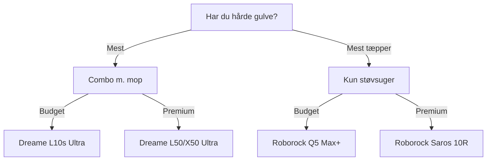

import { Card, CardGrid, Aside, Badge, Tabs, TabItem } from '@astrojs/starlight/components';
import FAQ from '../../../../components/FAQ.astro';
import HowTo from '../../../../components/HowTo.astro';

<HowTo
  name="Opsæt smart robotstøvsuger"
  description="Guide til robotstøvsugere med Home Assistant integration"
  totalTime="PT30M"
  steps={[
    "Vælg robotstøvsuger til dit hjem",
    "Installer og kør første kortlægning",
    "Tilslut til WiFi og app",
    "Integrer med Home Assistant",
    "Opret automationer baseret på tilstedeværelse"
  ]}
/>

<Badge text="Rengøring" variant="success" /> <Badge text="Automatik" variant="note" /> <Badge text="Smart Home" variant="tip" />

Robotstøvsugere holder dit hjem rent **automatisk hver dag**. Moderne modeller kombinerer støvsugning og mopning, tømmer sig selv, og kan styres fra Home Assistant baseret på hvornår du forlader hjemmet.

<Aside type="tip" title="Top Anbefalinger 2025">
- **Premium combo**: Dreame L50/X50 Ultra (~8.000 kr)
- **Bedste værdi**: Roborock Qrevo S5V (~5.000 kr)
- **Budget**: Dreame L10s Ultra (~4.000 kr)
- **Kun støvsuger**: Roborock Q5 Max+ (~2.500 kr)
- **Lokal kontrol**: Valetudo på Dreame/Roborock
</Aside>

---

## 🎯 Typer af Robotstøvsugere

### Overblik 2025

| Type | Beskrivelse | Vedligehold | Pris |
|------|-------------|-------------|------|
| **Kun støvsuger** | Simpel støvsugning | Tøm beholder | 💰 |
| **Støvsuger + mop** | Kombineret rengøring | Skift vand | 💰💰 |
| **Combo + auto-dock** | Selv-tømning + mopvask | Minimal | 💰💰💰 |
| **Premium all-in-one** | Alt automatisk | Næsten ingen | 💰💰💰💰 |

### Hvad skal du vælge?



---

## 🏆 Top Robotstøvsugere 2025

### Dreame L50 Ultra - Bedste Værdi

<Tabs>
  <TabItem label="Oversigt">
    **Pris:** ~8.000 kr / $1.100
    
    Dreame L50 Ultra er **årets bedste køb**:
    
    - ✅ 19.500 Pa sugekraft
    - ✅ ProLeap™ system (klatrer 6 cm tærskler!)
    - ✅ Selv-rensende mopper med varmluft-tørring
    - ✅ HyperStream anti-vikle børste
    - ✅ AI objekt-undvigelse (200+ objekter)
    - ✅ Udtrækbar sidebørste + mop
    - ✅ 3.2L støvpose (100 dage)
    
    **Ulemper:**
    - ❌ Stor dock
    - ❌ Cloud-afhængig (uden Valetudo)
    
    | Spec | Værdi |
    |------|-------|
    | Sugekraft | 19.500 Pa |
    | Batteri | 6.400 mAh |
    | Støj | ~67 dB |
    | Mop | Roterende dual-pads |
  </TabItem>
  <TabItem label="Home Assistant">
    ### Dreame Integration
    
    Via **Dreame integration** (HACS):
    
    ```yaml
    # HACS → Integrations → Dreame Vacuum
    # Kræver Dreame/Xiaomi konto
    
    # Entiteter:
    # - vacuum.dreame_l50_ultra
    # - sensor.dreame_l50_ultra_battery
    # - sensor.dreame_l50_ultra_cleaning_time
    # - button.dreame_l50_ultra_start_pause
    
    # Eksempel: Start ved afgang
    automation:
      - alias: "Start støvsuger når alle er væk"
        trigger:
          - platform: state
            entity_id: group.alle_personer
            to: "not_home"
            for: "00:05:00"
        condition:
          - condition: time
            after: "08:00:00"
            before: "20:00:00"
          - condition: state
            entity_id: vacuum.dreame_l50_ultra
            state: "docked"
        action:
          - service: vacuum.start
            entity_id: vacuum.dreame_l50_ultra
    ```
  </TabItem>
  <TabItem label="Valetudo">
    ### Lokal Kontrol med Valetudo
    
    Dreame L-serien understøtter **Valetudo** for 100% lokal kontrol:
    
    **Understøttede modeller:**
    - Dreame L10s Ultra ✅
    - Dreame L10s Pro Ultra Heat ✅
    - Dreame X40 Ultra ✅
    - Dreame L50 Ultra ✅ (nyeste)
    
    **Root kræver:**
    - 3.3V USB UART adapter
    - Dreame Breakout PCB
    - Minimal demontering
    
    ```yaml
    # Efter Valetudo installation
    # Forbind via MQTT til Home Assistant
    
    mqtt:
      broker: 192.168.1.x
      
    # Entiteter autodiscovers:
    # - vacuum.valetudo_dreame
    # - sensor.valetudo_dreame_battery
    # - camera.valetudo_dreame_map
    ```
    
    **Fordele ved Valetudo:**
    - ✅ Ingen cloud - 100% lokal
    - ✅ Ingen konto påkrævet
    - ✅ Ingen data deling
    - ✅ Hurtigere respons
    - ✅ MQTT integration
  </TabItem>
</Tabs>

**Køb:** [Amazon.de](https://amazon.de), [Dreame.dk](https://dreame.dk)

---

### Roborock Qrevo CurvX / Saros Z70

<Tabs>
  <TabItem label="Oversigt">
    **Pris:** ~9.000-11.000 kr / $1.200-1.500
    
    Roborock's **flagskibe for 2025**:
    
    | Feature | Qrevo CurvX | Saros Z70 |
    |---------|-------------|-----------|
    | Sugekraft | 18.500 Pa | 22.000 Pa |
    | Mop | Roterende | Roterende |
    | Robot-arm | Nej | ✅ OmniGrip |
    | Tærskel | 2 cm | 4 cm |
    | Pris | ~9.000 kr | ~11.000 kr |
    
    **Saros Z70 special:**
    - 🦾 OmniGrip robotarm (samler sko, sokker op!)
    - Klatrer 4 cm tærskler
    - Løfter krop på tæpper
    
    **Ulemper:**
    - ❌ Valetudo support er begrænset
    - ❌ Cloud-afhængig
    - ❌ Dyr
  </TabItem>
  <TabItem label="Home Assistant">
    ### Native Roborock Integration
    
    Home Assistant har **officiel Roborock integration**:
    
    ```yaml
    # Indstillinger → Enheder → Roborock
    # Login med Roborock konto
    
    # Entiteter:
    # - vacuum.roborock_s8_maxv
    # - sensor.roborock_s8_maxv_battery
    # - sensor.roborock_s8_maxv_last_clean_area
    # - number.roborock_s8_maxv_mop_intensity
    # - select.roborock_s8_maxv_mop_mode
    
    # Eksempel: Rum-specifik rengøring
    automation:
      - alias: "Rengør køkken efter madlavning"
        trigger:
          - platform: state
            entity_id: binary_sensor.komfur_aktiv
            from: "on"
            to: "off"
            for: "00:10:00"
        action:
          - service: vacuum.send_command
            entity_id: vacuum.roborock_qrevo
            data:
              command: app_segment_clean
              params:
                - segments: [16]  # Køkken segment ID
                  repeat: 1
    ```
  </TabItem>
</Tabs>

**Køb:** [Roborock.com](https://roborock.com), [Amazon.de](https://amazon.de)

---

### Ecovacs Deebot X11 - Bedste Sugekraft

**Pris:** ~9.000 kr / $1.250

Ecovacs X11 har **markedets stærkeste sugekraft**:

- ✅ 22.000 Pa sugekraft (OmniCyclone)
- ✅ Dual-kamera navigation
- ✅ OZMO Turbo 2.0 mopping
- ✅ Auto-tømning + mopvask + tørring
- ✅ TrueEdge kantmopping

**Ulemper:**
- ❌ Ingen Valetudo support
- ❌ Ecovacs app kan være buggy

### Home Assistant

```yaml
# HACS → Integrations → Ecovacs
# Kræver Ecovacs konto

# Entiteter:
# - vacuum.deebot_x11
# - sensor.deebot_x11_battery

automation:
  - alias: "Notifikation når støvsuger er færdig"
    trigger:
      - platform: state
        entity_id: vacuum.deebot_x11
        from: "cleaning"
        to: "returning"
    action:
      - service: notify.mobile_app
        data:
          title: "Rengøring færdig"
          message: "Deebot er på vej tilbage til dock"
```

**Køb:** [Ecovacs.dk](https://ecovacs.dk), [Elgiganten](https://elgiganten.dk)

---

## 💰 Budget Valg

### Roborock Q5 Max+ - Kun Støvsugning

**Pris:** ~2.500 kr / $350

Perfekt til **tæppe-dominerede hjem**:

- ✅ 5.500 Pa sugekraft
- ✅ LiDAR navigation
- ✅ Auto-tømning dock
- ✅ 180 min batteri
- ✅ Native HA integration

### Dreame L10s Ultra - Bedste Budget Combo

**Pris:** ~4.000 kr / $550

Stadig **fremragende i 2025**:

- ✅ 5.300 Pa sugekraft
- ✅ Mopvask + varmluft tørring
- ✅ LiDAR + AI navigation
- ✅ Valetudo support! ✅

---

## 🔧 Valetudo - Lokal Kontrol

### Hvad er Valetudo?

Valetudo er **cloud-erstatning** for robotstøvsugere:

| Fordel | Beskrivelse |
|--------|-------------|
| **100% Lokal** | Ingen data til cloud |
| **Ingen konto** | Intet login påkrævet |
| **MQTT** | Perfekt HA integration |
| **Hurtig** | Ingen cloud-forsinkelse |
| **Privatliv** | Kamera/mikrofon data lokalt |

### Understøttede Mærker

| Mærke | Support | Root Sværhed |
|-------|---------|--------------|
| **Dreame** | ✅ God | Let (UART) |
| **Roborock** | ⚠️ Ældre modeller | Sværere |
| **Xiaomi/Viomi** | ✅ God | Varierer |
| **Ecovacs** | ❌ Nej | N/A |

### Installation Oversigt

```bash
# 1. Tjek om din model er supporteret
# https://valetudo.cloud/pages/general/supported-robots.html

# 2. Bestil hardware
# - 3.3V USB UART adapter (~50 kr)
# - Dreame Breakout PCB (~100 kr)

# 3. Brug Dustbuilder til firmware
# https://builder.dontvacuum.me/

# 4. Flash via UART
# (følg guide på valetudo.cloud)

# 5. Konfigurer MQTT i Valetudo
# → Home Assistant autodiscovery
```

### Home Assistant med Valetudo

```yaml
# Valetudo bruger MQTT autodiscovery
# Ingen manuel konfiguration nødvendig!

# Entiteter:
# - vacuum.valetudo_[robot_name]
# - camera.valetudo_[robot_name]_map
# - sensor.valetudo_[robot_name]_battery
# - button.valetudo_[robot_name]_locate

# Lovelace kort til kort-visning
# HACS → Frontend → Xiaomi Vacuum Map Card
```

---

## 🏠 Smarte Automationer

### Start ved Afgang

```yaml
automation:
  - alias: "Støvsuger - Start når alle er væk"
    trigger:
      - platform: state
        entity_id: group.alle_personer
        to: "not_home"
        for: "00:05:00"
    condition:
      - condition: time
        after: "08:00:00"
        before: "20:00:00"
      - condition: state
        entity_id: vacuum.robot
        state: "docked"
      - condition: template
        value_template: >
          {{ now().weekday() < 5 }}  # Kun hverdage
    action:
      - service: vacuum.start
        entity_id: vacuum.robot
```

### Stop ved Hjemkomst

```yaml
automation:
  - alias: "Støvsuger - Stop når nogen kommer hjem"
    trigger:
      - platform: state
        entity_id: group.alle_personer
        to: "home"
    condition:
      - condition: state
        entity_id: vacuum.robot
        state: "cleaning"
    action:
      - service: vacuum.return_to_base
        entity_id: vacuum.robot
      - service: notify.mobile_app
        data:
          title: "Støvsuger stoppet"
          message: "Robot er på vej til dock da du kom hjem"
```

### Køkken efter Madlavning

```yaml
automation:
  - alias: "Rengør køkken efter madlavning"
    trigger:
      - platform: state
        entity_id: sensor.komfur_energi
        to: "idle"
        for: "00:15:00"
    condition:
      - condition: template
        value_template: >
          {{ states('sensor.komfur_energi_idag') | float > 0.5 }}
    action:
      - service: vacuum.send_command
        entity_id: vacuum.dreame
        data:
          command: app_segment_clean
          params:
            segments: [kitchen]
```

### Ugentlig Dybderengøring

```yaml
automation:
  - alias: "Ugentlig dybderengøring"
    trigger:
      - platform: time
        at: "10:00:00"
    condition:
      - condition: time
        weekday:
          - sat
      - condition: state
        entity_id: group.alle_personer
        state: "not_home"
    action:
      - service: vacuum.set_fan_speed
        entity_id: vacuum.robot
        data:
          fan_speed: "max"
      - service: vacuum.start
        entity_id: vacuum.robot
```

### Vedligeholdelsespåmindelse

```yaml
automation:
  - alias: "Påmind om filterrengøring"
    trigger:
      - platform: template
        value_template: >
          {{ states('sensor.vacuum_total_cleaning_time') | float > 50 }}
    action:
      - service: notify.mobile_app
        data:
          title: "🧹 Vedligeholdelse"
          message: "Tid til at rense støvsugerens filter (50+ timer)"
      - service: counter.reset
        entity_id: counter.vacuum_cleaning_hours
```

---

## 🛒 Købs Strategi

### Budget - Kun støvsuger (~2.500 kr)
- 1x Roborock Q5 Max+ (2.500 kr)
- **Total:** ~2.500 kr

### Starter Combo (~4.000 kr)
- 1x Dreame L10s Ultra (4.000 kr)
- Valetudo mulighed ✅
- **Total:** ~4.000 kr

### Premium All-in-one (~8.000 kr)
- 1x Dreame L50 Ultra (8.000 kr)
- Valetudo mulighed ✅
- **Total:** ~8.000 kr

### Ultimativ (~11.000 kr)
- 1x Roborock Saros Z70 (11.000 kr)
- OmniGrip robotarm
- **Total:** ~11.000 kr

---

## 🛒 Hvor Køber Jeg?

### Officielle Forhandlere
- **[Dreame.dk](https://dreame.dk)** - Dreame officiel
- **[Roborock.com](https://roborock.com)** - Roborock officiel
- **[Ecovacs.dk](https://ecovacs.dk)** - Ecovacs officiel

### Danske Butikker
- **[Elgiganten](https://elgiganten.dk)** - Alle mærker
- **[Power](https://power.dk)** - Alle mærker
- **[Proshop](https://proshop.dk)** - God pris

### International
- **[Amazon.de](https://amazon.de)** - Ofte billigere

---

## ❓ Ofte Stillede Spørgsmål

<FAQ questions={[
  {
    question: "Hvad er forskellen på Dreame og Roborock?",
    answer: "Begge laver fremragende robotter. Dreame har ofte bedre pris-ydelse og bedre Valetudo support. Roborock har lidt bedre app og mere etableret brand. I 2025 er Dreame L50 Ultra et bedre køb end tilsvarende Roborock."
  },
  {
    question: "Er Valetudo det værd?",
    answer: "Ja, hvis du vil have lokal kontrol og privatliv. Du mister ikke funktionalitet, og du får hurtigere respons + MQTT integration. Kræver dog lidt teknisk snilde at installere."
  },
  {
    question: "Kan robotstøvsugere klare kæledyrshår?",
    answer: "Ja! Moderne modeller med anti-vikle børster (Dreame HyperStream, Roborock DuoDivide) håndterer langt hår og kæledyrshår uden at sætte sig fast."
  },
  {
    question: "Hvor ofte skal robotten køre?",
    answer: "De fleste kører dagligt på standard sugekraft. Med kæledyr eller børn kan 2x dagligt være nødvendigt. Ugentlig dybderengøring på max anbefales."
  },
  {
    question: "Virker moppen godt?",
    answer: "Moderne roterende mopper (2024-2025 modeller) er overraskende gode. De erstatter ikke grundig manuelt mopning, men holder gulve pæne dagligt. Spinning pads er bedre end vibrating pads."
  },
  {
    question: "Skal jeg købe selv-tømmende dock?",
    answer: "Absolut! Auto-tømning + mopvask + tørring reducerer vedligehold til næsten ingenting. Det er værd at betale ekstra for."
  }
]} />

---

## 📚 Næste Skridt

<CardGrid>
  <Card title="Smart Belysning" icon="sun">
    Tænd lys når robotten kører.
    
    [Se guide →](/da/produkter/smart-belysning/)
  </Card>
  <Card title="Tilstedeværelse" icon="rocket">
    Automatiser baseret på hvem der er hjemme.
    
    [Se guide →](/da/automationer/)
  </Card>
</CardGrid>

---

*Sidst opdateret: December 2025*
