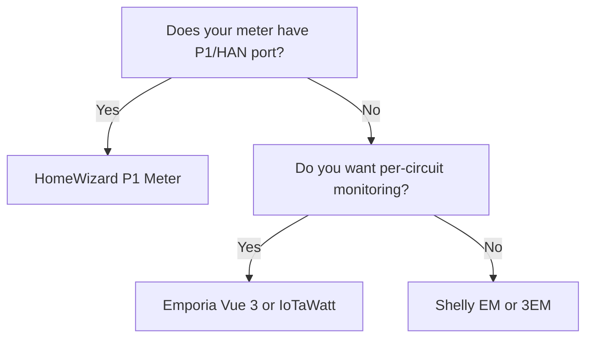

import { Card, CardGrid, Aside, Badge, Tabs, TabItem } from '@astrojs/starlight/components';
import FAQ from '../../../../components/FAQ.astro';
import HowTo from '../../../../components/HowTo.astro';

<HowTo
  name="Set up energy monitoring in your home"
  description="Guide to energy meters and Home Assistant Energy Dashboard"
  totalTime="PT45M"
  steps={[
    "Choose energy meter for your needs",
    "Install CT clamps or smart meter reader",
    "Integrate with Home Assistant",
    "Configure Energy Dashboard",
    "Analyze and optimize your usage"
  ]}
/>

<Badge text="Energy" variant="success" /> <Badge text="Savings" variant="tip" /> <Badge text="Local" variant="note" />

Energy monitoring is the **foundation for smart power management**. By measuring your consumption, you can identify power hogs, optimize usage, and save money - especially with dynamic electricity rates.

<Aside type="tip" title="Top Recommendations 2025">
- **Europe (P1/HAN)**: HomeWizard P1 Meter (~$50)
- **Whole house (WiFi)**: Shelly Pro 3EM (~$140)
- **Per circuit**: Emporia Vue 3 (~$200)
- **Power user**: IoTaWatt (~$280)
- **Budget**: Shelly EM Gen3 (~$55)
</Aside>

---

## 📊 Types of Energy Monitoring

### Measurement Levels

| Type | What's measured | Best for | Example |
|------|-----------------|----------|---------|
| **Smart Meter Port** | Whole house via utility meter | EU countries | HomeWizard |
| **Main meter** | Grid input | Total overview | Shelly 3EM |
| **Per circuit** | Individual breakers | Find power hogs | Emporia Vue |
| **Per device** | Single appliance | Precise measurement | Smart plug |

### What Should You Choose?



---

## 🇪🇺 Smart Meter Ports - Europe

Many European smart meters have a **P1/HAN port** providing real-time data:

### HomeWizard P1 Meter

**Price:** ~$50

<Tabs>
  <TabItem label="Overview">
    ### Why HomeWizard?
    
    HomeWizard is the **easiest solution** for homes with smart meters:
    
    - ✅ Plug-and-play (5 min installation)
    - ✅ **Works with Home Assistant** certified
    - ✅ Real-time data (1 sec updates)
    - ✅ No electrical installation
    - ✅ Local API (no cloud)
    - ✅ Import AND export measurement
    - ✅ Gas and water support (with extra devices)
    
    **Disadvantages:**
    - ❌ Requires P1/HAN port on meter
    - ❌ Only total consumption (not per circuit)
  </TabItem>
  <TabItem label="Installation">
    ### Easy Installation
    
    1. **Find your smart meter** (usually in utility closet)
    2. **Connect P1 cable** to RJ12 port
    3. **Download HomeWizard app**
    4. **Add to WiFi**
    5. **Done!**
    
    ⚠️ **Check if your meter has P1/HAN port:**
    - Most meters installed after 2015 have it
    - Contact your utility if unsure
  </TabItem>
  <TabItem label="Home Assistant">
    ### HA Integration
    
    HomeWizard is **auto-discovered**:
    
    ```yaml
    # No configuration needed!
    # Settings → Devices → Add Integration → HomeWizard
    
    # Entities you get:
    # - sensor.p1_meter_active_power (W)
    # - sensor.p1_meter_total_energy_import (kWh)
    # - sensor.p1_meter_total_energy_export (kWh)
    # - sensor.p1_meter_active_voltage_l1 (V)
    
    # Energy Dashboard
    # Settings → Dashboards → Energy
    # Grid consumption: sensor.p1_meter_total_energy_import
    # Return to grid: sensor.p1_meter_total_energy_export
    ```
  </TabItem>
</Tabs>

**Buy:** [HomeWizard.com](https://homewizard.com), [Amazon](https://amazon.com)

---

## ⚡ Shelly Energy Meters

### Shelly Lineup

| Model | Phases | Channels | Price ~ | Best for |
|-------|--------|----------|---------|----------|
| **Shelly EM Gen3** | Single | 2 | $55 | Budget |
| **Shelly Pro EM-50** | Single | 2 | $70 | DIN mounting |
| **Shelly Pro 3EM** | 3-phase | 3 | $140 | Whole house |
| **Shelly Pro 3EM-400** | 3-phase | 3 (400A) | $170 | Large installations |

---

## 🏠 Shelly Pro 3EM

<Tabs>
  <TabItem label="Overview">
    ### Why Shelly Pro 3EM?
    
    **Price:** ~$140
    
    Shelly Pro 3EM is **best for whole-house monitoring**:
    
    - ✅ WiFi + Ethernet (stable)
    - ✅ 3 phases up to 120A each
    - ✅ Bi-directional (import/export)
    - ✅ DIN-rail mounting
    - ✅ ±1% accuracy
    - ✅ Local API + MQTT
    - ✅ Native HA integration
    
    **Disadvantages:**
    - ❌ Requires electrical installation
    - ❌ Only main monitoring (not per circuit)
  </TabItem>
  <TabItem label="Installation">
    ### Electrical Installation
    
    ⚠️ **Requires licensed electrician!**
    
    **Components:**
    - Shelly Pro 3EM
    - 3x CT clamps (included)
    
    **Installation:**
    1. Mount Shelly on DIN rail in panel
    2. Connect 230V supply (L+N)
    3. Clip CT clamps on each phase
    4. Connect CT cables to Shelly
    5. Configure via Shelly app
  </TabItem>
  <TabItem label="Home Assistant">
    ### HA Integration
    
    ```yaml
    # Shelly auto-discovered
    # Settings → Devices → Add Integration → Shelly
    
    # Entities per phase:
    # - sensor.shelly_pro_3em_phase_a_power
    # - sensor.shelly_pro_3em_phase_a_energy
    # - sensor.shelly_pro_3em_phase_a_voltage
    # - sensor.shelly_pro_3em_total_active_power
    
    # Template for total consumption
    template:
      - sensor:
          - name: "Total Power"
            unit_of_measurement: "W"
            state: >
              {{ states('sensor.shelly_pro_3em_phase_a_power')|float +
                 states('sensor.shelly_pro_3em_phase_b_power')|float +
                 states('sensor.shelly_pro_3em_phase_c_power')|float }}
    ```
  </TabItem>
</Tabs>

**Buy:** [Shelly.cloud](https://shelly.cloud), [Amazon](https://amazon.com)

---

## 📈 Emporia Vue 3 - Per Circuit

<Tabs>
  <TabItem label="Overview">
    ### Why Emporia Vue 3?
    
    **Price:** ~$200 (with 16 sensors)
    
    Emporia Vue 3 is **best for circuit-level monitoring**:
    
    - ✅ Up to 16 individual circuits
    - ✅ Identify power hogs
    - ✅ WiFi + Ethernet
    - ✅ Solar/net-metering support
    - ✅ Can flash to ESPHome (local!)
    
    **Disadvantages:**
    - ❌ Cloud-dependent by default
    - ❌ Requires DIY for local control
    - ❌ Primarily US market (split-phase)
  </TabItem>
  <TabItem label="ESPHome Flash">
    ### Local with ESPHome
    
    Flash Emporia Vue for **100% local control**:
    
    ```yaml
    # emporia-vue3.yaml
    esphome:
      name: emporia-vue3
    
    external_components:
      - source: github://digiblur/esphome-vue3@dev
        components:
          - emporia_vue
    
    esp32:
      board: esp32dev
      framework:
        type: esp-idf
    
    wifi:
      ssid: !secret wifi_ssid
      password: !secret wifi_password
    
    api:
    
    sensor:
      - platform: emporia_vue
        phases:
          - id: phase_a
            input: "A"
            calibration: 0.022
            power:
              name: "Phase A Power"
            # ... more sensors
    ```
    
    **Guide:** [digiblur.com](https://digiblur.com/2024/03/14/emporia-vue-gen3-esp32-esphome-home-assistant/)
  </TabItem>
</Tabs>

**Buy:** [Amazon](https://amazon.com), [Emporia Energy](https://emporiaenergy.com)

---

## 🔧 IoTaWatt - Power User

**Price:** ~$280

IoTaWatt is the **community favorite** for advanced users:

| Pros | Cons |
|------|------|
| ✅ 14 CT inputs | ❌ Expensive |
| ✅ 100% local (no cloud) | ❌ Hard to get in Europe |
| ✅ Open source | ❌ More complex setup |
| ✅ Very accurate | ❌ Requires electrical knowledge |
| ✅ Web interface | |
| ✅ Influx/Emoncms export | |

### Home Assistant Integration

```yaml
# IoTaWatt integrates via REST or MQTT
# HACS: IoTaWatt integration

# Settings → Devices → Add Integration → IoTaWatt
# Enter IoTaWatt IP address

# Entities:
# - sensor.iotawatt_mains
# - sensor.iotawatt_heat_pump
# - sensor.iotawatt_ev_charger
# etc.
```

**Buy:** [IoTaWatt.com](https://iotawatt.com)

---

## 🔌 Smart Plugs with Energy Monitoring

For **single-device monitoring** use smart plugs:

| Model | Protocol | Max Load | Price ~ |
|-------|----------|----------|---------|
| **Shelly Plug S** | WiFi | 2500W | $28 |
| **Shelly Plus Plug S** | WiFi | 2500W | $35 |
| **Nous A1T** | WiFi (Tasmota) | 3680W | $14 |
| **IKEA TRETAKT** | Zigbee | 2300W | $14 |
| **Aqara Smart Plug** | Zigbee | 2300W | $21 |

### Combination: Whole + Details

```yaml
# Best strategy: Main meter + smart plugs

# 1. Shelly 3EM measures total consumption
# 2. Smart plugs on large consumers:
#    - Washing machine
#    - Dryer
#    - Dishwasher
#    - Gaming PC
#    - Refrigerator

# Template: "Other consumption"
template:
  - sensor:
      - name: "Other Power Usage"
        unit_of_measurement: "W"
        state: >
          
          
          
          
          {{ (total - washer - dryer - fridge)|round(1) }}
```

---

## 📱 Home Assistant Energy Dashboard

### Configuration

Home Assistant's **Energy Dashboard** provides fantastic insights:

1. **Settings** → **Dashboards** → **Energy**
2. **Electricity grid:**
   - Grid consumption: Your import sensor
   - Return to grid: Your export sensor (if solar)
3. **Solar panels:** (optional)
   - Solar production sensor
4. **Individual devices:**
   - Add smart plugs with energy monitoring

### Electricity Price Integration

```yaml
# For dynamic pricing (varies by region)
# Options: Nordpool, Amber Electric, Octopus Energy

# Example: Nordpool for Europe
# HACS → Integrations → Nordpool

nordpool:

# Energy Dashboard:
# - Use entity tracking current price
```

---

## 💰 Automations for Savings

### Run appliances when power is cheap

```yaml
automation:
  - alias: "Start washing machine at low price"
    trigger:
      - platform: numeric_state
        entity_id: sensor.electricity_price
        below: 0.10  # Under $0.10/kWh
    condition:
      - condition: state
        entity_id: input_boolean.washer_waiting
        state: "on"
      - condition: time
        after: "06:00:00"
        before: "22:00:00"
    action:
      - service: switch.turn_on
        entity_id: switch.washing_machine_plug
      - service: notify.mobile_app
        data:
          title: "Washer started"
          message: "Power price is now {{ states('sensor.electricity_price') }}/kWh"
```

### Alert on high power

```yaml
automation:
  - alias: "Alert on high consumption"
    trigger:
      - platform: numeric_state
        entity_id: sensor.shelly_3em_total_power
        above: 5000  # Over 5 kW
        for:
          minutes: 5
    action:
      - service: notify.mobile_app
        data:
          title: "⚡ High power usage!"
          message: "Your consumption is {{ states('sensor.shelly_3em_total_power') }}W right now"
```

### Find standby consumption

```yaml
automation:
  - alias: "Report: Night consumption"
    trigger:
      - platform: time
        at: "06:00:00"
    action:
      - service: notify.mobile_app
        data:
          title: "Night usage report"
          message: >
            Last night you used {{ 
              (states('sensor.shelly_3em_energy_today')|float * 
               (6/24))|round(2) 
            }} kWh while sleeping.
```

---

## 🛒 Buying Strategy

### Starter - Smart Meter (~$50)
- 1x HomeWizard P1 Meter ($50)
- **Total:** ~$50

### Basic - Main Monitoring (~$200)
- 1x Shelly Pro 3EM ($140)
- Electrician installation (~$70)
- **Total:** ~$210

### Complete - Per Circuit (~$420)
- 1x HomeWizard P1 ($50)
- 1x Emporia Vue 3 16-pack ($200)
- 4x Shelly smart plugs ($110)
- Installation (~$70)
- **Total:** ~$430

### Premium - Full Insight (~$700)
- 1x IoTaWatt + 14 CT ($350)
- 1x HomeWizard P1 ($50)
- 6x Shelly smart plugs ($170)
- Installation (~$140)
- **Total:** ~$710

---

## 🛒 Where to Buy?

### Smart Meter Readers
- **[HomeWizard.com](https://homewizard.com)** - Direct
- **[Amazon](https://amazon.com)** - Various options

### CT-based Meters
- **[Shelly.cloud](https://shelly.cloud)** - Shelly products
- **[Amazon](https://amazon.com)** - Everything
- **[IoTaWatt.com](https://iotawatt.com)** - IoTaWatt

### Smart Plugs
- **[IKEA](https://ikea.com)** - TRETAKT Zigbee
- **[Amazon](https://amazon.com)** - Shelly, Nous

---

## ❓ Frequently Asked Questions

<FAQ questions={[
  {
    question: "Does my smart meter have a P1/HAN port?",
    answer: "Most European smart meters installed after 2015 have P1/HAN ports. Check for an RJ12 connector on the meter, or contact your utility company. Older meters typically don't have this port."
  },
  {
    question: "What's the difference between CT clamps and P1?",
    answer: "P1 reads data directly from your utility meter - easy but only total consumption. CT clamps physically measure current and can be placed on individual circuits, but require electrical installation."
  },
  {
    question: "Do I need an electrician for installation?",
    answer: "For P1 and smart plugs: No. For CT-based meters in your electrical panel: Yes, it's legally required in most places and dangerous without experience. Budget $70-140 for installation."
  },
  {
    question: "Can I see consumption per room?",
    answer: "Not directly with main meter. Use either Emporia Vue with CT on each breaker, or smart plugs on larger appliances. Combination of both gives best insight."
  },
  {
    question: "How much can I save?",
    answer: "Typically 10-20% by identifying power hogs and shifting consumption to cheap hours. With dynamic electricity rates, savings can be even higher."
  },
  {
    question: "Does energy monitoring work with solar panels?",
    answer: "Yes! Bi-directional meters (Shelly 3EM, HomeWizard P1) can measure both import and export. Home Assistant Energy Dashboard shows production, consumption, and net usage."
  }
]} />

---

## 📚 Next Steps

<CardGrid>
  <Card title="Dynamic Electricity Prices" icon="rocket">
    Take advantage of cheap hours.
    
    [See guide →](/en/home-assistant/elpris-integration/)
  </Card>
  <Card title="Home Assistant" icon="setting">
    Integrate everything in one system.
    
    [Get started →](/en/home-assistant/)
  </Card>
</CardGrid>

---

*Last updated: December 2025*
