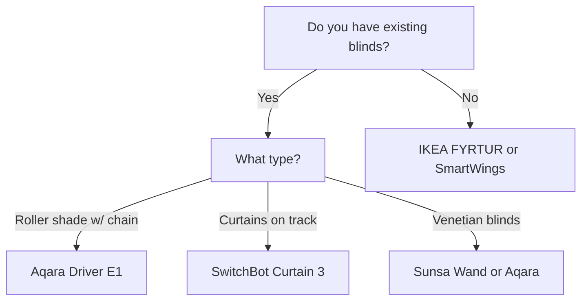

import { Card, CardGrid, Aside, Badge, Tabs, TabItem } from '@astrojs/starlight/components';
import FAQ from '../../../../components/FAQ.astro';
import HowTo from '../../../../components/HowTo.astro';

<HowTo
  name="Set up smart blinds"
  description="Guide to motorized blinds and shades with Home Assistant"
  totalTime="PT30M"
  steps={[
    "Choose blind type for your windows",
    "Install motor or complete blind",
    "Pair with Zigbee hub or WiFi",
    "Integrate with Home Assistant",
    "Create sun and time automations"
  ]}
/>

<Badge text="Blinds" variant="success" /> <Badge text="Automation" variant="note" /> <Badge text="Energy" variant="tip" />

Smart blinds provide **automatic light and temperature control** - close blinds at sunset, open at sunrise, or block sun when it gets too hot. Combined with sensors, you get an intelligent home that adapts itself.

<Aside type="tip" title="Top Recommendations 2025">
- **Budget complete**: IKEA FYRTUR (~$130)
- **Retrofit roller shade**: Aqara Roller Shade Driver E1 (~$55)
- **Retrofit curtains**: SwitchBot Curtain 3 (~$100)
- **Premium**: Lutron Serena (~$400+)
- **DIY motor**: Zemismart Zigbee motor (~$70)
</Aside>

---

## 🎯 Types of Smart Blinds

### Overview

| Type | Description | Installation | Price |
|------|-------------|--------------|-------|
| **Complete blind** | Motor built-in | Replace existing | 💰💰 |
| **Retrofit motor** | Motor for existing | Add to blind | 💰 |
| **Chain driver** | Rotates bead chain | Simple addition | 💰 |
| **Track motor** | Motor for curtain track | Mount on track | 💰💰 |

### What Should You Choose?



---

## 🏆 IKEA FYRTUR - Best Budget

<Tabs>
  <TabItem label="Overview">
    ### Why IKEA FYRTUR?
    
    **Price:** ~$130-200 (depending on size)
    
    FYRTUR is the **best choice for most people**:
    
    - ✅ Complete solution (blind + motor)
    - ✅ 100% blackout
    - ✅ Zigbee (works with ZHA, Z2M)
    - ✅ Remote included
    - ✅ Rechargeable battery (4-6 months)
    - ✅ HomeKit/Alexa/Google via DIRIGERA
    - ✅ Multiple sizes (23-48 inch width)
    
    **Disadvantages:**
    - ❌ Limited sizes
    - ❌ Only gray/white colors
    - ❌ Zigbee pairing can be tricky
    
    **Other IKEA models:**
    | Model | Type | Price ~ |
    |-------|------|---------|
    | **FYRTUR** | Blackout | $130-200 |
    | **KADRILJ** | Semi-transparent | $130-190 |
    | **PRAKTLYSING** | Cellular blackout | $160-220 |
    | **TREDANSEN** | Cellular blackout | $160-220 |
  </TabItem>
  <TabItem label="Installation">
    ### Easy Installation
    
    1. **Mount brackets** on wall or ceiling
    2. **Click blind into place**
    3. **Connect battery**
    4. **Pair remote** (pre-paired)
    5. **Set limits** (up/down positions)
    
    ### Charging
    
    - USB-C cable included
    - Battery lasts 4-6 months
    - Charge without dismounting
    
    **Pro tip:** Mount blind so USB port is accessible!
  </TabItem>
  <TabItem label="Home Assistant">
    ### HA Integration via ZHA/Z2M
    
    FYRTUR works best with **Zigbee2MQTT**:
    
    ```yaml
    # Zigbee2MQTT configuration
    # Pair: Hold pairing button 10 sec (on motor)
    
    # Entities:
    # - cover.ikea_fyrtur_living_room
    # - sensor.ikea_fyrtur_living_room_battery
    
    # Example: Open at sunrise
    automation:
      - alias: "Open blinds at sunrise"
        trigger:
          - platform: sun
            event: sunrise
            offset: "00:15:00"
        condition:
          - condition: workday
        action:
          - service: cover.open_cover
            entity_id: cover.ikea_fyrtur_bedroom

      - alias: "Close blinds at sunset"
        trigger:
          - platform: sun
            event: sunset
            offset: "-00:15:00"
        action:
          - service: cover.close_cover
            entity_id: 
              - cover.ikea_fyrtur_living_room
              - cover.ikea_fyrtur_bedroom
    ```
  </TabItem>
</Tabs>

**Buy:** [IKEA](https://ikea.com)

---

## 🔧 Aqara Roller Shade Driver E1

<Tabs>
  <TabItem label="Overview">
    ### Why Aqara Driver E1?
    
    **Price:** ~$55
    
    Aqara E1 **motorizes existing roller shades**:
    
    - ✅ Retrofit (keep your shade)
    - ✅ Zigbee 3.0
    - ✅ USB-C charging
    - ✅ 2-month battery
    - ✅ HomeKit via Aqara hub
    - ✅ Works with bead chains
    - ✅ Easy 10-min installation
    
    **Disadvantages:**
    - ❌ Requires Aqara hub for HomeKit
    - ❌ Only for chain-operated shades
    - ❌ Visible motor unit
    
    **Compatible chains:**
    - Plastic beads: 3-6 mm
    - Metal balls: 3-4.5 mm
  </TabItem>
  <TabItem label="Installation">
    ### 10-Minute Installation
    
    1. **Mount holder** next to shade
    2. **Feed chain** through motor
    3. **Clip motor in place**
    4. **Pair with Aqara app**
    5. **Calibrate up/down positions**
    
    ⚠️ **Check chain type first!** 
    - Measure bead/ball diameter
    - Must be 3-6 mm
  </TabItem>
  <TabItem label="Home Assistant">
    ### HA Integration
    
    Via **Aqara hub** or direct **ZHA/Z2M**:
    
    ```yaml
    # Direct Zigbee pairing
    # Entities:
    # - cover.aqara_roller_shade_kitchen
    # - sensor.aqara_roller_shade_kitchen_battery
    
    # Example: Close on high temperature
    automation:
      - alias: "Close blinds on heat"
        trigger:
          - platform: numeric_state
            entity_id: sensor.living_room_temperature
            above: 75  # Fahrenheit
        condition:
          - condition: sun
            after: sunrise
            before: sunset
        action:
          - service: cover.close_cover
            entity_id: cover.aqara_roller_shade_living_room
    ```
  </TabItem>
</Tabs>

**Buy:** [Amazon](https://amazon.com), [AliExpress](https://aliexpress.com)

---

## 🎭 SwitchBot Curtain 3 - For Curtain Tracks

<Tabs>
  <TabItem label="Overview">
    ### Why SwitchBot Curtain 3?
    
    **Price:** ~$100
    
    SwitchBot Curtain 3 **motorizes curtain tracks**:
    
    - ✅ Works with U-rail and I-rail tracks
    - ✅ Solar panel accessory (never charge)
    - ✅ Touch & Go (pull to activate)
    - ✅ QuietDrift mode (ultra quiet)
    - ✅ Matter support via Hub
    - ✅ Up to 35 lbs curtain
    
    **Disadvantages:**
    - ❌ Requires Hub for full smart integration
    - ❌ Visible on track
    - ❌ Bluetooth only without hub
    
    **Accessories:**
    | Product | Price ~ |
    |---------|---------|
    | **SwitchBot Hub Mini** | $42 |
    | **Solar Panel** | $21 |
    | **Remote** | $21 |
  </TabItem>
  <TabItem label="Installation">
    ### Installation on Track
    
    1. **Choose correct adapter** (U/I-rail)
    2. **Mount SwitchBot** on track
    3. **Connect to curtain hook**
    4. **Pair via SwitchBot app**
    5. **Calibrate open/closed position**
    
    **Track types:**
    - **U-rail**: Standard curved track
    - **I-rail**: Thin/flat track
    - **Rod**: Curtain rod (requires Rod adapter)
  </TabItem>
  <TabItem label="Home Assistant">
    ### HA Integration
    
    Requires **SwitchBot Hub** for WiFi:
    
    ```yaml
    # Via SwitchBot integration
    # Settings → Devices → SwitchBot
    
    # Entities:
    # - cover.switchbot_curtain_living_room
    # - sensor.switchbot_curtain_living_room_battery
    # - sensor.switchbot_curtain_living_room_light
    
    # Example: Open on morning motion
    automation:
      - alias: "Open curtains on morning activity"
        trigger:
          - platform: state
            entity_id: binary_sensor.bedroom_motion
            to: "on"
        condition:
          - condition: time
            after: "06:00:00"
            before: "09:00:00"
          - condition: state
            entity_id: cover.switchbot_curtain_bedroom
            state: "closed"
        action:
          - service: cover.open_cover
            entity_id: cover.switchbot_curtain_bedroom
    ```
  </TabItem>
</Tabs>

**Buy:** [SwitchBot.com](https://switchbot.com), [Amazon](https://amazon.com)

---

## 🏗️ Zemismart - DIY Motor

**Price:** ~$55-110

Zemismart offers **standalone tubular motors** for roller shades:

| Model | Protocol | Price ~ | Best for |
|-------|----------|---------|----------|
| **AM15** | Zigbee | $70 | Smart home |
| **AM25** | WiFi/Tuya | $55 | Tuya ecosystem |
| **Solar** | Zigbee + solar | $100 | Hard to reach |
| **Battery** | RF + battery | $85 | Simple setup |

### Installation

⚠️ **Requires DIY experience:**

1. Remove existing shade
2. Mount tubular motor in tube
3. Reinstall fabric
4. Pair with Zigbee/WiFi

**Pro tip:** Buy motor matching your tube diameter (25mm, 35mm, 38mm).

**Buy:** [AliExpress](https://aliexpress.com), [Amazon](https://amazon.com)

---

## 💎 Premium: Lutron Serena

**Price:** ~$400-1000+

Lutron Serena is the **premium solution**:

| Pros | Cons |
|------|------|
| ✅ 200+ fabric/color choices | ❌ Very expensive |
| ✅ Perfect integration | ❌ Requires Lutron hub |
| ✅ Professional quality | ❌ Custom order |
| ✅ Super quiet motor | |
| ✅ Battery or wired | |
| ✅ HomeKit/Alexa/Google | |

### Home Assistant

```yaml
# Lutron Caséta integration
# Settings → Devices → Lutron Caséta

# Entities:
# - cover.serena_living_room
# - cover.serena_bedroom
```

**Buy:** [Lutron.com](https://lutron.com)

---

## 🏠 Smart Automations

### Basic: Sunrise/Sunset

```yaml
automation:
  - alias: "Blinds at sunrise"
    trigger:
      - platform: sun
        event: sunrise
        offset: "00:15:00"
    condition:
      - condition: workday
    action:
      - service: cover.open_cover
        entity_id: 
          - cover.bedroom
          - cover.living_room

  - alias: "Blinds at sunset"
    trigger:
      - platform: sun
        event: sunset
        offset: "-00:15:00"
    action:
      - service: cover.close_cover
        entity_id: all
```

### Advanced: Temperature-based

```yaml
automation:
  - alias: "Block sun on heat"
    trigger:
      - platform: numeric_state
        entity_id: sensor.living_room_temperature
        above: 77  # Fahrenheit
    condition:
      - condition: sun
        after: sunrise
        before: sunset
      - condition: numeric_state
        entity_id: sensor.outdoor_temperature
        above: 68
    action:
      - service: cover.close_cover
        entity_id: cover.living_room_south
      - service: notify.mobile_app
        data:
          title: "Blinds closed"
          message: "Blocking sun due to temperature over 77°F"

  - alias: "Open blinds when cooling"
    trigger:
      - platform: numeric_state
        entity_id: sensor.living_room_temperature
        below: 73
    condition:
      - condition: state
        entity_id: cover.living_room_south
        state: "closed"
    action:
      - service: cover.open_cover
        entity_id: cover.living_room_south
```

### Theater Mode (with media)

```yaml
automation:
  - alias: "Close blinds for movie"
    trigger:
      - platform: state
        entity_id: media_player.living_room_tv
        to: "playing"
    condition:
      - condition: template
        value_template: >
          {{ state_attr('media_player.living_room_tv', 'media_content_type') == 'movie' }}
      - condition: sun
        before: sunset
    action:
      - service: cover.close_cover
        entity_id: cover.living_room
      - service: light.turn_on
        entity_id: light.living_room
        data:
          brightness_pct: 10
```

### Vacation Mode

```yaml
automation:
  - alias: "Simulate presence"
    trigger:
      - platform: time_pattern
        hours: "/2"  # Every 2 hours
    condition:
      - condition: state
        entity_id: input_boolean.vacation_mode
        state: "on"
      - condition: sun
        after: sunset
        before: sunrise
    action:
      - delay:
          minutes: "{{ range(5, 30)|random }}"
      - service: cover.set_cover_position
        entity_id: cover.living_room
        data:
          position: "{{ range(20, 80)|random }}"
```

---

## 🛒 Buying Strategy

### Starter - One window (~$130)
- 1x IKEA FYRTUR ($130)
- **Total:** ~$130

### Basic - 3 windows (~$240)
- 3x Aqara Roller Shade Driver E1 ($165)
- 1x Aqara Hub M2 ($70)
- Existing roller shades
- **Total:** ~$235

### Complete living room (~$570)
- 2x IKEA FYRTUR ($340)
- 2x SwitchBot Curtain 3 ($200)
- 1x SwitchBot Hub Mini ($42)
- **Total:** ~$582

### Whole house (~$1,400)
- 6x IKEA FYRTUR ($1,020)
- 2x Aqara Driver E1 ($110)
- 1x Aqara Hub ($70)
- 2x SwitchBot Curtain ($200)
- **Total:** ~$1,400

---

## 🛒 Where to Buy?

### Complete Solutions
- **[IKEA](https://ikea.com)** - FYRTUR, KADRILJ
- **[Lutron.com](https://lutron.com)** - Premium Serena

### Retrofit Motors
- **[Amazon](https://amazon.com)** - Aqara, SwitchBot
- **[AliExpress](https://aliexpress.com)** - Zemismart, budget
- **[SwitchBot.com](https://switchbot.com)** - Curtain 3

---

## ❓ Frequently Asked Questions

<FAQ questions={[
  {
    question: "Can I automate my existing blinds?",
    answer: "Yes! Aqara Roller Shade Driver E1 works with chain roller shades, SwitchBot Curtain 3 works with curtain track curtains. You don't need to buy new blinds."
  },
  {
    question: "How long does the battery last?",
    answer: "IKEA FYRTUR: 4-6 months. Aqara E1: 2 months. SwitchBot: 8 months (or infinite with solar panel). Depends on usage."
  },
  {
    question: "Does IKEA FYRTUR work with Home Assistant?",
    answer: "Yes, via Zigbee2MQTT or ZHA. Pairing can be a bit tricky, but works well once set up. You don't need IKEA's hub."
  },
  {
    question: "What's the difference between FYRTUR and KADRILJ?",
    answer: "FYRTUR is 100% blackout - perfect for bedrooms. KADRILJ is semi-transparent and filters light without blocking completely."
  },
  {
    question: "Can I control blinds based on the sun?",
    answer: "Yes! Home Assistant can trigger on sunrise/sunset, sun position, and even calculate if the sun hits a specific window based on azimuth."
  },
  {
    question: "Are smart blinds worth it?",
    answer: "Absolutely for bedrooms (automatic blackout) and south-facing windows (block heat in summer). The savings on cooling can be significant."
  }
]} />

---

## 📚 Next Steps

<CardGrid>
  <Card title="Smart Lighting" icon="sun">
    Combine blinds with lighting.
    
    [See guide →](/en/products/smart-lighting/)
  </Card>
  <Card title="Smart Thermostats" icon="sun">
    Optimize temperature with blinds.
    
    [See guide →](/en/products/smart-thermostats/)
  </Card>
</CardGrid>

---

*Last updated: December 2025*
