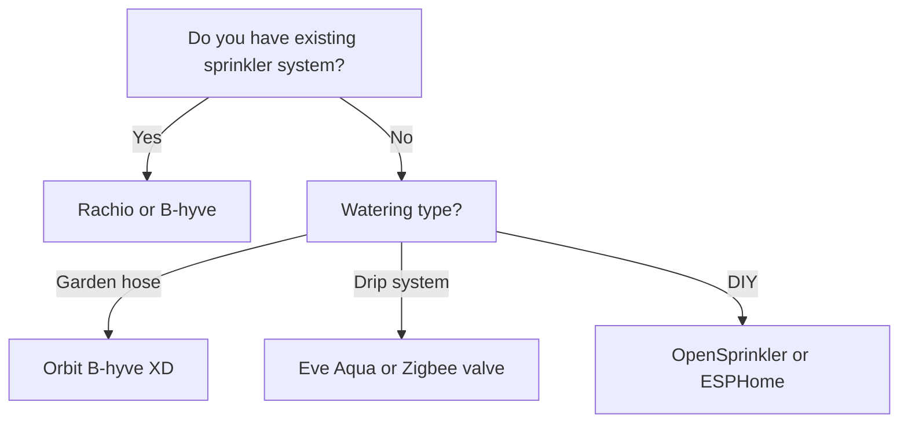

import { Card, CardGrid, Aside, Badge, Tabs, TabItem } from '@astrojs/starlight/components';
import FAQ from '../../../../components/FAQ.astro';
import HowTo from '../../../../components/HowTo.astro';

<HowTo
  name="Set up smart garden irrigation"
  description="Guide to automatic watering with weather data and soil moisture"
  totalTime="PT45M"
  steps={[
    "Choose irrigation controller for your needs",
    "Install controller and valves",
    "Connect to WiFi and app",
    "Integrate with Home Assistant",
    "Add sensors and automations"
  ]}
/>

<Badge text="Garden" variant="success" /> <Badge text="Irrigation" variant="note" /> <Badge text="Automation" variant="tip" />

Smart garden irrigation saves **up to 50% water** by using weather data, soil moisture, and intelligent schedules. Stop watering when it rains, and ensure your plants get exactly the amount of water they need.

<Aside type="tip" title="Top Recommendations 2025">
- **Premium**: Rachio 3 (~$180)
- **Best value**: Orbit B-hyve (~$95)
- **DIY/Local**: OpenSprinkler (~$190)
- **Hose timer**: Orbit B-hyve XD (~$65)
- **Plant sensor**: Xiaomi Mi Flora (~$20)
</Aside>

---

## 🎯 Types of Smart Irrigation

### Overview

| Type | Description | Installation | Price |
|------|-------------|--------------|-------|
| **Sprinkler controller** | Replaces existing timer | Electrical work | 💰💰 |
| **Hose timer** | Mounts on faucet | Simple | 💰 |
| **Drip system** | For raised beds/pots | DIY | 💰 |
| **DIY ESPHome** | Full control | Advanced | 💰 |

### What Should You Choose?



---

## 🏆 Rachio 3 - Premium Choice

<Tabs>
  <TabItem label="Overview">
    ### Why Rachio 3?
    
    **Price:** ~$180 (8 zones)
    
    Rachio 3 is the **market leader** in smart irrigation:
    
    - ✅ Weather Intelligence Plus (hyperlocal weather)
    - ✅ EPA WaterSense certified
    - ✅ Saves up to 50% water
    - ✅ 8 or 16 zones
    - ✅ HomeKit, Alexa, Google, SmartThings
    - ✅ Native Home Assistant integration
    - ✅ Excellent app and support
    
    **Disadvantages:**
    - ❌ Requires outdoor enclosure ($30 extra)
    - ❌ Cloud-dependent
    - ❌ More expensive than competitors
    
    **Models:**
    | Model | Zones | Price ~ |
    |-------|-------|---------|
    | **Rachio 3** | 8 | $180 |
    | **Rachio 3** | 16 | $230 |
    | **Rachio 3e** | 8 | $130 |
  </TabItem>
  <TabItem label="Installation">
    ### Installation
    
    1. **Turn off power** to existing controller
    2. **Photograph wires** before removal
    3. **Mount Rachio** (indoors or with enclosure)
    4. **Connect wires** (zone 1-8/16 + common)
    5. **Download app** and configure WiFi
    6. **Set up zones** with plant type, sun, soil
    
    ⚠️ **Requires 24V AC transformer** (often included)
    
    **Pro tip:** Take photos of all wires!
  </TabItem>
  <TabItem label="Home Assistant">
    ### HA Integration
    
    Native integration - easy setup:
    
    ```yaml
    # Settings → Devices → Rachio
    # Use your Rachio API key
    
    # Entities:
    # - switch.rachio_zone_1
    # - switch.rachio_zone_2
    # - binary_sensor.rachio_rain_delay
    # - sensor.rachio_daily_water_usage
    
    # Example: Skip watering on rain
    automation:
      - alias: "Skip watering on rain"
        trigger:
          - platform: state
            entity_id: weather.home
            attribute: forecast
        condition:
          - condition: template
            value_template: >
              {{ state_attr('weather.home', 'forecast')[0].precipitation > 0.2 }}
        action:
          - service: rachio.set_rain_delay
            data:
              entity_id: switch.rachio_zone_1
              duration: 86400  # 24 hours
    
      - alias: "Notification on watering"
        trigger:
          - platform: state
            entity_id: switch.rachio_zone_1
            to: "on"
        action:
          - service: notify.mobile_app
            data:
              title: "Garden Irrigation"
              message: "Zone 1 is watering for 15 minutes"
    ```
  </TabItem>
</Tabs>

**Buy:** [Amazon](https://amazon.com), [Rachio.com](https://rachio.com)

---

## 💰 Orbit B-hyve - Best Value

<Tabs>
  <TabItem label="Overview">
    ### Why Orbit B-hyve?
    
    **Price:** ~$95 (8 zones)
    
    B-hyve provides **nearly the same features at half the price**:
    
    - ✅ WeatherSense technology
    - ✅ EPA WaterSense certified
    - ✅ Weatherproof enclosure (XR model)
    - ✅ 6, 8, or 12 zones
    - ✅ Alexa and Google Assistant
    - ✅ Manual controls on device
    - ✅ Easy app with guided setup
    
    **Disadvantages:**
    - ❌ No HomeKit
    - ❌ Less precise weather data than Rachio
    - ❌ Limited HA integration
    
    **Models:**
    | Model | Zones | Location | Price ~ |
    |-------|-------|----------|---------|
    | **B-hyve** | 6 | Indoor | $80 |
    | **B-hyve** | 12 | Indoor | $100 |
    | **B-hyve XR** | 8 | Outdoor | $120 |
  </TabItem>
  <TabItem label="Installation">
    ### Easy Installation
    
    1. **Disconnect power** to old controller
    2. **Mount B-hyve** (weatherproof XR can be outside)
    3. **Connect zone wires**
    4. **Download B-hyve app**
    5. **Follow setup wizard**
    
    The app guides you through:
    - Zone type (grass, flowers, vegetables)
    - Soil type (sand, clay, loam)
    - Slope and sun exposure
  </TabItem>
  <TabItem label="Home Assistant">
    ### HA Integration
    
    Via HACS custom integration:
    
    ```yaml
    # HACS → Integrations → B-hyve
    # Requires Orbit account login
    
    # Entities:
    # - switch.bhyve_zone_1
    # - sensor.bhyve_next_watering
    
    # Example: Water based on soil moisture
    automation:
      - alias: "Water on low soil moisture"
        trigger:
          - platform: numeric_state
            entity_id: sensor.garden_soil_moisture
            below: 30
        condition:
          - condition: time
            after: "05:00:00"
            before: "07:00:00"
          - condition: state
            entity_id: binary_sensor.rain_today
            state: "off"
        action:
          - service: switch.turn_on
            entity_id: switch.bhyve_zone_1
          - delay: "00:15:00"
          - service: switch.turn_off
            entity_id: switch.bhyve_zone_1
    ```
  </TabItem>
</Tabs>

**Buy:** [Amazon](https://amazon.com), [Home Depot](https://homedepot.com)

---

## 🔧 OpenSprinkler - DIY & Local

<Tabs>
  <TabItem label="Overview">
    ### Why OpenSprinkler?
    
    **Price:** ~$190 (8 zones)
    
    OpenSprinkler is **open source and 100% local**:
    
    - ✅ No cloud - full local control
    - ✅ Open source software
    - ✅ MQTT support
    - ✅ Raspberry Pi version (OSPi)
    - ✅ Advanced watering algorithms
    - ✅ Add sensors via GPIO
    
    **Disadvantages:**
    - ❌ More complex setup
    - ❌ No voice assistant directly
    - ❌ Requires technical understanding
    
    **Models:**
    | Model | Type | Price ~ |
    |-------|------|---------|
    | **OpenSprinkler 3.2** | Standalone | $190 |
    | **OSPi** | Raspberry Pi HAT | $110 |
    | **OpenSprinkler DC** | 9V battery | $165 |
  </TabItem>
  <TabItem label="Installation">
    ### OSPi Installation
    
    1. **Install Raspberry Pi** with Raspberry Pi OS
    2. **Mount OSPi HAT** on Pi
    3. **Connect 24V transformer**
    4. **Connect zone valves**
    5. **Install OpenSprinkler software**
    
    ```bash
    # Install OpenSprinkler on Pi
    cd ~
    git clone https://github.com/OpenSprinkler/OpenSprinkler-Firmware.git
    cd OpenSprinkler-Firmware
    sudo ./build.sh ospi
    ```
  </TabItem>
  <TabItem label="Home Assistant">
    ### HA Integration via MQTT
    
    ```yaml
    # OpenSprinkler integration
    # Settings → Devices → OpenSprinkler
    
    # Or via MQTT:
    mqtt:
      switch:
        - name: "Garden Zone 1"
          state_topic: "opensprinkler/zone/1/state"
          command_topic: "opensprinkler/zone/1/cmd"
          payload_on: "ON"
          payload_off: "OFF"
    
    # Example: Advanced watering automation
    automation:
      - alias: "Smart watering with ET"
        trigger:
          - platform: time
            at: "05:00:00"
        condition:
          - condition: template
            value_template: >
              {{ states('sensor.evapotranspiration') | float > 0.12 }}
          - condition: template
            value_template: >
              {{ states('sensor.soil_moisture') | float < 40 }}
        action:
          - service: switch.turn_on
            entity_id: switch.garden_zone_1
          - delay:
              minutes: >
                {{ (states('sensor.evapotranspiration') | float * 120) | int }}
          - service: switch.turn_off
            entity_id: switch.garden_zone_1
    ```
  </TabItem>
</Tabs>

**Buy:** [OpenSprinkler.com](https://opensprinkler.com)

---

## 🚿 Hose Timers - Simple Solution

For gardens without sprinkler systems - mount directly on faucet:

| Product | Protocol | Price ~ | HA Integration |
|---------|----------|---------|----------------|
| **Orbit B-hyve XD** | Bluetooth/WiFi | $65 | Via B-hyve integration |
| **Eve Aqua** | Thread/HomeKit | $100 | Via HomeKit |
| **Zigbee water valve** | Zigbee | $40 | Direct |
| **Meross Smart Water Timer** | WiFi | $55 | Via Meross integration |

### Orbit B-hyve XD Example

```yaml
# B-hyve integration via HACS
# Supports hose timers too

automation:
  - alias: "Water raised bed every evening"
    trigger:
      - platform: sun
        event: sunset
        offset: "+01:00:00"
    condition:
      - condition: numeric_state
        entity_id: sensor.openweathermap_precipitation
        below: 0.1
    action:
      - service: switch.turn_on
        entity_id: switch.bhyve_hose_timer
      - delay: "00:15:00"
      - service: switch.turn_off
        entity_id: switch.bhyve_hose_timer
```

---

## 🌱 Plant Sensors

### Xiaomi Mi Flora (Flower Care)

**Price:** ~$20

The popular **4-in-1 plant sensor**:

- ✅ Soil moisture
- ✅ Temperature
- ✅ Light intensity
- ✅ Soil conductivity (nutrients)
- ✅ Battery (1 year+)
- ✅ Bluetooth → HA via ESP32 proxy

### Home Assistant Integration

```yaml
# Via Xiaomi BLE integration
# Auto-discovered with Bluetooth

# Or via ESPHome Bluetooth Proxy:
esphome:
  name: ble-proxy
  
esp32:
  board: esp32dev

bluetooth_proxy:
  active: true

# Entities in HA:
# - sensor.mi_flora_living_room_moisture
# - sensor.mi_flora_living_room_temperature
# - sensor.mi_flora_living_room_illuminance
# - sensor.mi_flora_living_room_conductivity
# - sensor.mi_flora_living_room_battery
```

### Plant Monitor Integration

```yaml
# configuration.yaml
plant:
  tomato_plant:
    sensors:
      moisture: sensor.mi_flora_tomato_moisture
      temperature: sensor.mi_flora_tomato_temperature
      conductivity: sensor.mi_flora_tomato_conductivity
      brightness: sensor.mi_flora_tomato_illuminance
    min_moisture: 20
    max_moisture: 60
    min_temperature: 59  # Fahrenheit
    max_temperature: 95
    min_conductivity: 350
    max_conductivity: 2000
    min_brightness: 2000
    max_brightness: 50000

# Automation for thirsty plant
automation:
  - alias: "Notification - Plant thirsty"
    trigger:
      - platform: state
        entity_id: plant.tomato_plant
        to: "problem"
    action:
      - service: notify.mobile_app
        data:
          title: "🌱 Plant needs water"
          message: "Tomato plant has low soil moisture"
```

### Other Plant Sensors

| Sensor | Protocol | Features | Price ~ |
|--------|----------|----------|---------|
| **Xiaomi Mi Flora** | BLE | Moisture, temp, light, nutrients | $20 |
| **ECOWITT soil sensor** | 433MHz | Moisture only | $20 |
| **SensorPush** | BLE/WiFi | Moisture, temp (precise) | $55 |
| **ThirdReality** | Zigbee | Moisture only | $20 |

---

## 🏠 Smart Automations

### Weather-based Watering

```yaml
automation:
  - alias: "Skip watering on rain in forecast"
    trigger:
      - platform: time
        at: "04:00:00"  # Check before scheduled watering
    condition:
      - condition: template
        value_template: >
          
          
            
              
            
          
          {{ dominated.rain }}
    action:
      - service: input_boolean.turn_on
        entity_id: input_boolean.skip_watering_today
      - service: notify.mobile_app
        data:
          title: "Watering skipped"
          message: "Rain expected - skipping watering"
```

### Soil Moisture + Time

```yaml
automation:
  - alias: "Intelligent garden watering"
    trigger:
      - platform: time
        at: "05:30:00"
    condition:
      - condition: numeric_state
        entity_id: sensor.garden_soil_moisture
        below: 35
      - condition: state
        entity_id: input_boolean.skip_watering_today
        state: "off"
      - condition: template
        value_template: >
          {{ states('sensor.openweathermap_precipitation_probability') | float < 40 }}
    action:
      - service: switch.turn_on
        entity_id: switch.garden_zone_1
      - delay: "00:20:00"
      - service: switch.turn_off
        entity_id: switch.garden_zone_1
      - service: switch.turn_on
        entity_id: switch.garden_zone_2
      - delay: "00:15:00"
      - service: switch.turn_off
        entity_id: switch.garden_zone_2
```

### Vacation Mode

```yaml
automation:
  - alias: "Vacation - Increased watering"
    trigger:
      - platform: state
        entity_id: input_boolean.vacation_mode
        to: "on"
    action:
      - service: rachio.set_schedule
        data:
          entity_id: switch.rachio_zone_1
          duration: 1800  # 30 min instead of 15
      - service: notify.mobile_app
        data:
          title: "Vacation mode activated"
          message: "Watering time increased to 30 min per zone"
```

---

## 🛠️ DIY: ESPHome Irrigation System

### Simple Relay-based System

```yaml
# esphome/garden_irrigation.yaml
esphome:
  name: garden-irrigation

esp32:
  board: esp32dev

wifi:
  ssid: !secret wifi_ssid
  password: !secret wifi_password

# 4-channel relay module for valves
switch:
  - platform: gpio
    pin: GPIO16
    name: "Garden Zone 1 - Lawn"
    id: zone_1
    
  - platform: gpio
    pin: GPIO17
    name: "Garden Zone 2 - Flower bed"
    id: zone_2
    
  - platform: gpio
    pin: GPIO18
    name: "Garden Zone 3 - Raised bed"
    id: zone_3
    
  - platform: gpio
    pin: GPIO19
    name: "Garden Zone 4 - Hedge"
    id: zone_4

# Soil moisture sensor (capacitive)
sensor:
  - platform: adc
    pin: GPIO34
    name: "Lawn Soil Moisture"
    update_interval: 60s
    unit_of_measurement: "%"
    filters:
      - calibrate_linear:
          - 0.0 -> 100.0  # Wet
          - 3.3 -> 0.0    # Dry
      - sliding_window_moving_average:
          window_size: 5
          send_every: 5

# Auto-off after 30 min (safety)
script:
  - id: auto_off_zone_1
    then:
      - delay: 30min
      - switch.turn_off: zone_1
```

---

## 🛒 Buying Strategy

### Starter - Garden hose (~$65)
- 1x Orbit B-hyve XD ($65)
- **Total:** ~$65

### Raised beds/Pots (~$80)
- 1x Zigbee water valve ($40)
- 1x Xiaomi Mi Flora ($20)
- Drip hoses ($20)
- **Total:** ~$80

### Sprinkler system (~$150)
- 1x Orbit B-hyve 8-zone ($120)
- 2x Xiaomi Mi Flora ($40)
- **Total:** ~$160

### Premium Smart Garden (~$350)
- 1x Rachio 3 8-zone ($180)
- 1x Rachio Flow Meter ($55)
- 4x Xiaomi Mi Flora ($80)
- 1x ESP32 BLE Proxy ($15)
- **Total:** ~$330

---

## 🛒 Where to Buy?

### Irrigation Controllers
- **[Amazon](https://amazon.com)** - Rachio, Orbit B-hyve
- **[OpenSprinkler.com](https://opensprinkler.com)** - OpenSprinkler
- **[Home Depot](https://homedepot.com)** - Orbit, Rain Bird

### Sensors
- **[AliExpress](https://aliexpress.com)** - Xiaomi Mi Flora
- **[Amazon](https://amazon.com)** - Various sensors

---

## ❓ Frequently Asked Questions

<FAQ questions={[
  {
    question: "How much water can I save with smart irrigation?",
    answer: "Typically 20-50% depending on your current usage. EPA WaterSense certified controllers like Rachio and B-hyve are designed to minimize water consumption."
  },
  {
    question: "Do Rachio and B-hyve work internationally?",
    answer: "Yes, both work worldwide. Weather data is fetched via internet, so location isn't an issue. You just need the appropriate voltage transformer for your region."
  },
  {
    question: "Can I use plant sensors for automatic watering?",
    answer: "Yes! Combine Xiaomi Mi Flora with a Zigbee water valve in Home Assistant. When soil moisture drops below a threshold, watering activates automatically."
  },
  {
    question: "What's the difference between Rachio and OpenSprinkler?",
    answer: "Rachio is easier to set up with an excellent app, but cloud-dependent. OpenSprinkler is 100% local and open source, but requires more technical knowledge."
  },
  {
    question: "How do I get Mi Flora data to Home Assistant?",
    answer: "Either via the built-in Xiaomi BLE integration (requires Bluetooth on HA), or via an ESP32 as Bluetooth proxy placed closer to your plants."
  },
  {
    question: "Can I water based on weather forecast?",
    answer: "Yes! Home Assistant can check weather forecast and skip watering if rain is expected. Rachio and B-hyve also have built-in rain skip functionality."
  }
]} />

---

## 📚 Next Steps

<CardGrid>
  <Card title="Smart Lighting" icon="sun">
    Outdoor lighting for the garden.
    
    [See guide →](/en/products/smart-lighting/)
  </Card>
  <Card title="Energy Management" icon="rocket">
    Monitor garden water usage.
    
    [See guide →](/en/products/energy-management/)
  </Card>
</CardGrid>

---

*Last updated: December 2025*
