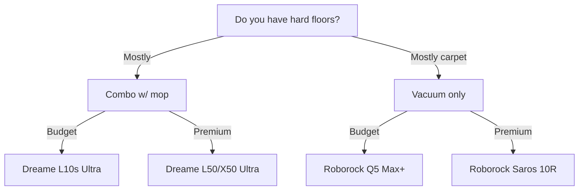

import { Card, CardGrid, Aside, Badge, Tabs, TabItem } from '@astrojs/starlight/components';
import FAQ from '../../../../components/FAQ.astro';
import HowTo from '../../../../components/HowTo.astro';

<HowTo
  name="Set up smart robot vacuum"
  description="Guide to robot vacuums with Home Assistant integration"
  totalTime="PT30M"
  steps={[
    "Choose robot vacuum for your home",
    "Install and run first mapping",
    "Connect to WiFi and app",
    "Integrate with Home Assistant",
    "Create presence-based automations"
  ]}
/>

<Badge text="Cleaning" variant="success" /> <Badge text="Automation" variant="note" /> <Badge text="Smart Home" variant="tip" />

Robot vacuums keep your home clean **automatically every day**. Modern models combine vacuuming and mopping, empty themselves, and can be controlled from Home Assistant based on when you leave home.

<Aside type="tip" title="Top Recommendations 2025">
- **Premium combo**: Dreame L50/X50 Ultra (~$1,100)
- **Best value**: Roborock Qrevo S5V (~$700)
- **Budget**: Dreame L10s Ultra (~$550)
- **Vacuum only**: Roborock Q5 Max+ (~$350)
- **Local control**: Valetudo on Dreame/Roborock
</Aside>

---

## 🎯 Types of Robot Vacuums

### Overview 2025

| Type | Description | Maintenance | Price |
|------|-------------|-------------|-------|
| **Vacuum only** | Simple vacuuming | Empty bin | 💰 |
| **Vacuum + mop** | Combined cleaning | Change water | 💰💰 |
| **Combo + auto-dock** | Self-empty + mop wash | Minimal | 💰💰💰 |
| **Premium all-in-one** | Everything automatic | Almost none | 💰💰💰💰 |

### What Should You Choose?



---

## 🏆 Top Robot Vacuums 2025

### Dreame L50 Ultra - Best Value

<Tabs>
  <TabItem label="Overview">
    **Price:** ~$1,100
    
    Dreame L50 Ultra is **best buy of the year**:
    
    - ✅ 19,500 Pa suction power
    - ✅ ProLeap™ system (climbs 2.4" thresholds!)
    - ✅ Self-cleaning mops with hot-air drying
    - ✅ HyperStream anti-tangle brush
    - ✅ AI obstacle avoidance (200+ objects)
    - ✅ Extendable side brush + mop
    - ✅ 3.2L dust bag (100 days)
    
    **Disadvantages:**
    - ❌ Large dock
    - ❌ Cloud-dependent (without Valetudo)
    
    | Spec | Value |
    |------|-------|
    | Suction | 19,500 Pa |
    | Battery | 6,400 mAh |
    | Noise | ~67 dB |
    | Mop | Rotating dual-pads |
  </TabItem>
  <TabItem label="Home Assistant">
    ### Dreame Integration
    
    Via **Dreame integration** (HACS):
    
    ```yaml
    # HACS → Integrations → Dreame Vacuum
    # Requires Dreame/Xiaomi account
    
    # Entities:
    # - vacuum.dreame_l50_ultra
    # - sensor.dreame_l50_ultra_battery
    # - sensor.dreame_l50_ultra_cleaning_time
    # - button.dreame_l50_ultra_start_pause
    
    # Example: Start when leaving
    automation:
      - alias: "Start vacuum when everyone leaves"
        trigger:
          - platform: state
            entity_id: group.all_people
            to: "not_home"
            for: "00:05:00"
        condition:
          - condition: time
            after: "08:00:00"
            before: "20:00:00"
          - condition: state
            entity_id: vacuum.dreame_l50_ultra
            state: "docked"
        action:
          - service: vacuum.start
            entity_id: vacuum.dreame_l50_ultra
    ```
  </TabItem>
  <TabItem label="Valetudo">
    ### Local Control with Valetudo
    
    Dreame L-series supports **Valetudo** for 100% local control:
    
    **Supported models:**
    - Dreame L10s Ultra ✅
    - Dreame L10s Pro Ultra Heat ✅
    - Dreame X40 Ultra ✅
    - Dreame L50 Ultra ✅ (newest)
    
    **Root requires:**
    - 3.3V USB UART adapter
    - Dreame Breakout PCB
    - Minimal disassembly
    
    ```yaml
    # After Valetudo installation
    # Connect via MQTT to Home Assistant
    
    mqtt:
      broker: 192.168.1.x
      
    # Entities autodiscover:
    # - vacuum.valetudo_dreame
    # - sensor.valetudo_dreame_battery
    # - camera.valetudo_dreame_map
    ```
    
    **Benefits of Valetudo:**
    - ✅ No cloud - 100% local
    - ✅ No account required
    - ✅ No data sharing
    - ✅ Faster response
    - ✅ MQTT integration
  </TabItem>
</Tabs>

**Buy:** [Amazon](https://amazon.com), [Dreame.com](https://dreame.com)

---

### Roborock Qrevo CurvX / Saros Z70

<Tabs>
  <TabItem label="Overview">
    **Price:** ~$1,200-1,500
    
    Roborock's **2025 flagships**:
    
    | Feature | Qrevo CurvX | Saros Z70 |
    |---------|-------------|-----------|
    | Suction | 18,500 Pa | 22,000 Pa |
    | Mop | Rotating | Rotating |
    | Robot arm | No | ✅ OmniGrip |
    | Threshold | 0.8" | 1.6" |
    | Price | ~$1,200 | ~$1,500 |
    
    **Saros Z70 special:**
    - 🦾 OmniGrip robot arm (picks up shoes, socks!)
    - Climbs 1.6" thresholds
    - Lifts body on carpets
    
    **Disadvantages:**
    - ❌ Valetudo support is limited
    - ❌ Cloud-dependent
    - ❌ Expensive
  </TabItem>
  <TabItem label="Home Assistant">
    ### Native Roborock Integration
    
    Home Assistant has **official Roborock integration**:
    
    ```yaml
    # Settings → Devices → Roborock
    # Login with Roborock account
    
    # Entities:
    # - vacuum.roborock_s8_maxv
    # - sensor.roborock_s8_maxv_battery
    # - sensor.roborock_s8_maxv_last_clean_area
    # - number.roborock_s8_maxv_mop_intensity
    # - select.roborock_s8_maxv_mop_mode
    
    # Example: Room-specific cleaning
    automation:
      - alias: "Clean kitchen after cooking"
        trigger:
          - platform: state
            entity_id: binary_sensor.stove_active
            from: "on"
            to: "off"
            for: "00:10:00"
        action:
          - service: vacuum.send_command
            entity_id: vacuum.roborock_qrevo
            data:
              command: app_segment_clean
              params:
                - segments: [16]  # Kitchen segment ID
                  repeat: 1
    ```
  </TabItem>
</Tabs>

**Buy:** [Roborock.com](https://roborock.com), [Amazon](https://amazon.com)

---

### Ecovacs Deebot X11 - Best Suction

**Price:** ~$1,250

Ecovacs X11 has **market's strongest suction**:

- ✅ 22,000 Pa suction (OmniCyclone)
- ✅ Dual-camera navigation
- ✅ OZMO Turbo 2.0 mopping
- ✅ Auto-empty + mop wash + drying
- ✅ TrueEdge edge mopping

**Disadvantages:**
- ❌ No Valetudo support
- ❌ Ecovacs app can be buggy

### Home Assistant

```yaml
# HACS → Integrations → Ecovacs
# Requires Ecovacs account

# Entities:
# - vacuum.deebot_x11
# - sensor.deebot_x11_battery

automation:
  - alias: "Notification when vacuum is done"
    trigger:
      - platform: state
        entity_id: vacuum.deebot_x11
        from: "cleaning"
        to: "returning"
    action:
      - service: notify.mobile_app
        data:
          title: "Cleaning done"
          message: "Deebot is returning to dock"
```

**Buy:** [Ecovacs.com](https://ecovacs.com), [Best Buy](https://bestbuy.com)

---

## 💰 Budget Choices

### Roborock Q5 Max+ - Vacuum Only

**Price:** ~$350

Perfect for **carpet-dominated homes**:

- ✅ 5,500 Pa suction
- ✅ LiDAR navigation
- ✅ Auto-empty dock
- ✅ 180 min battery
- ✅ Native HA integration

### Dreame L10s Ultra - Best Budget Combo

**Price:** ~$550

Still **excellent in 2025**:

- ✅ 5,300 Pa suction
- ✅ Mop wash + hot-air drying
- ✅ LiDAR + AI navigation
- ✅ Valetudo support! ✅

---

## 🔧 Valetudo - Local Control

### What is Valetudo?

Valetudo is **cloud replacement** for robot vacuums:

| Benefit | Description |
|---------|-------------|
| **100% Local** | No data to cloud |
| **No account** | No login required |
| **MQTT** | Perfect HA integration |
| **Fast** | No cloud latency |
| **Privacy** | Camera/mic data stays local |

### Supported Brands

| Brand | Support | Root Difficulty |
|-------|---------|-----------------|
| **Dreame** | ✅ Good | Easy (UART) |
| **Roborock** | ⚠️ Older models | Harder |
| **Xiaomi/Viomi** | ✅ Good | Varies |
| **Ecovacs** | ❌ No | N/A |

### Installation Overview

```bash
# 1. Check if your model is supported
# https://valetudo.cloud/pages/general/supported-robots.html

# 2. Order hardware
# - 3.3V USB UART adapter (~$7)
# - Dreame Breakout PCB (~$15)

# 3. Use Dustbuilder for firmware
# https://builder.dontvacuum.me/

# 4. Flash via UART
# (follow guide on valetudo.cloud)

# 5. Configure MQTT in Valetudo
# → Home Assistant autodiscovery
```

### Home Assistant with Valetudo

```yaml
# Valetudo uses MQTT autodiscovery
# No manual configuration needed!

# Entities:
# - vacuum.valetudo_[robot_name]
# - camera.valetudo_[robot_name]_map
# - sensor.valetudo_[robot_name]_battery
# - button.valetudo_[robot_name]_locate

# Lovelace card for map display
# HACS → Frontend → Xiaomi Vacuum Map Card
```

---

## 🏠 Smart Automations

### Start When Leaving

```yaml
automation:
  - alias: "Vacuum - Start when everyone leaves"
    trigger:
      - platform: state
        entity_id: group.all_people
        to: "not_home"
        for: "00:05:00"
    condition:
      - condition: time
        after: "08:00:00"
        before: "20:00:00"
      - condition: state
        entity_id: vacuum.robot
        state: "docked"
      - condition: template
        value_template: >
          {{ now().weekday() < 5 }}  # Weekdays only
    action:
      - service: vacuum.start
        entity_id: vacuum.robot
```

### Stop When Arriving

```yaml
automation:
  - alias: "Vacuum - Stop when someone comes home"
    trigger:
      - platform: state
        entity_id: group.all_people
        to: "home"
    condition:
      - condition: state
        entity_id: vacuum.robot
        state: "cleaning"
    action:
      - service: vacuum.return_to_base
        entity_id: vacuum.robot
      - service: notify.mobile_app
        data:
          title: "Vacuum stopped"
          message: "Robot returning to dock since you came home"
```

### Kitchen After Cooking

```yaml
automation:
  - alias: "Clean kitchen after cooking"
    trigger:
      - platform: state
        entity_id: sensor.stove_energy
        to: "idle"
        for: "00:15:00"
    condition:
      - condition: template
        value_template: >
          {{ states('sensor.stove_energy_today') | float > 0.5 }}
    action:
      - service: vacuum.send_command
        entity_id: vacuum.dreame
        data:
          command: app_segment_clean
          params:
            segments: [kitchen]
```

### Weekly Deep Clean

```yaml
automation:
  - alias: "Weekly deep cleaning"
    trigger:
      - platform: time
        at: "10:00:00"
    condition:
      - condition: time
        weekday:
          - sat
      - condition: state
        entity_id: group.all_people
        state: "not_home"
    action:
      - service: vacuum.set_fan_speed
        entity_id: vacuum.robot
        data:
          fan_speed: "max"
      - service: vacuum.start
        entity_id: vacuum.robot
```

### Maintenance Reminder

```yaml
automation:
  - alias: "Remind about filter cleaning"
    trigger:
      - platform: template
        value_template: >
          {{ states('sensor.vacuum_total_cleaning_time') | float > 50 }}
    action:
      - service: notify.mobile_app
        data:
          title: "🧹 Maintenance"
          message: "Time to clean vacuum filter (50+ hours)"
      - service: counter.reset
        entity_id: counter.vacuum_cleaning_hours
```

---

## 🛒 Buying Strategy

### Budget - Vacuum only (~$350)
- 1x Roborock Q5 Max+ ($350)
- **Total:** ~$350

### Starter Combo (~$550)
- 1x Dreame L10s Ultra ($550)
- Valetudo option ✅
- **Total:** ~$550

### Premium All-in-one (~$1,100)
- 1x Dreame L50 Ultra ($1,100)
- Valetudo option ✅
- **Total:** ~$1,100

### Ultimate (~$1,500)
- 1x Roborock Saros Z70 ($1,500)
- OmniGrip robot arm
- **Total:** ~$1,500

---

## 🛒 Where to Buy?

### Official Retailers
- **[Dreame.com](https://dreame.com)** - Dreame official
- **[Roborock.com](https://roborock.com)** - Roborock official
- **[Ecovacs.com](https://ecovacs.com)** - Ecovacs official

### US Retailers
- **[Amazon](https://amazon.com)** - All brands
- **[Best Buy](https://bestbuy.com)** - All brands
- **[Walmart](https://walmart.com)** - Good prices

---

## ❓ Frequently Asked Questions

<FAQ questions={[
  {
    question: "What's the difference between Dreame and Roborock?",
    answer: "Both make excellent robots. Dreame often has better price-performance and better Valetudo support. Roborock has slightly better app and more established brand. In 2025, Dreame L50 Ultra is a better buy than equivalent Roborock."
  },
  {
    question: "Is Valetudo worth it?",
    answer: "Yes, if you want local control and privacy. You don't lose functionality, and you get faster response + MQTT integration. However, it requires some technical skill to install."
  },
  {
    question: "Can robot vacuums handle pet hair?",
    answer: "Yes! Modern models with anti-tangle brushes (Dreame HyperStream, Roborock DuoDivide) handle long hair and pet hair without getting tangled."
  },
  {
    question: "How often should the robot run?",
    answer: "Most run daily on standard suction. With pets or kids, 2x daily may be needed. Weekly deep cleaning on max is recommended."
  },
  {
    question: "Does the mop work well?",
    answer: "Modern rotating mops (2024-2025 models) are surprisingly good. They don't replace thorough manual mopping, but keep floors nice daily. Spinning pads are better than vibrating pads."
  },
  {
    question: "Should I buy a self-emptying dock?",
    answer: "Absolutely! Auto-empty + mop wash + drying reduces maintenance to almost nothing. It's worth paying extra for."
  }
]} />

---

## 📚 Next Steps

<CardGrid>
  <Card title="Smart Lighting" icon="sun">
    Turn on lights when robot runs.
    
    [See guide →](/en/products/smart-lighting/)
  </Card>
  <Card title="Presence Detection" icon="rocket">
    Automate based on who's home.
    
    [See guide →](/en/guides/home-assistant/automations/)
  </Card>
</CardGrid>

---

*Last updated: December 2025*
